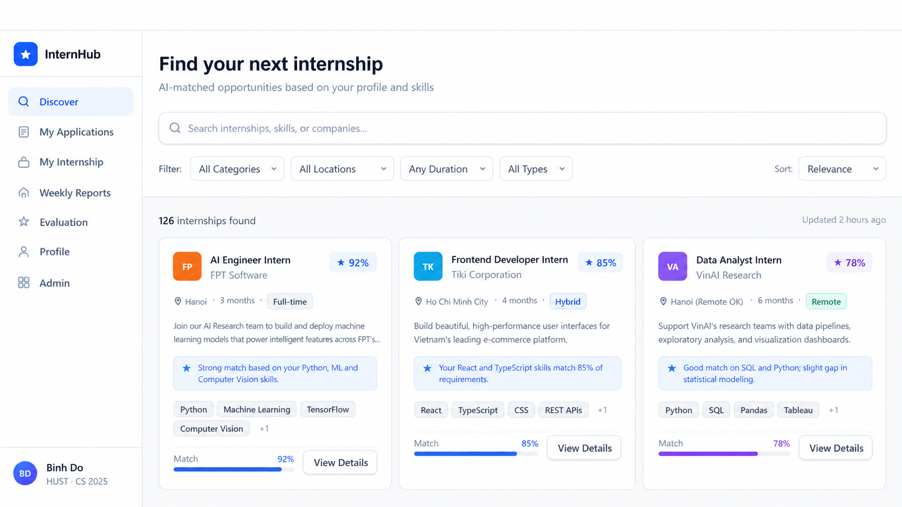
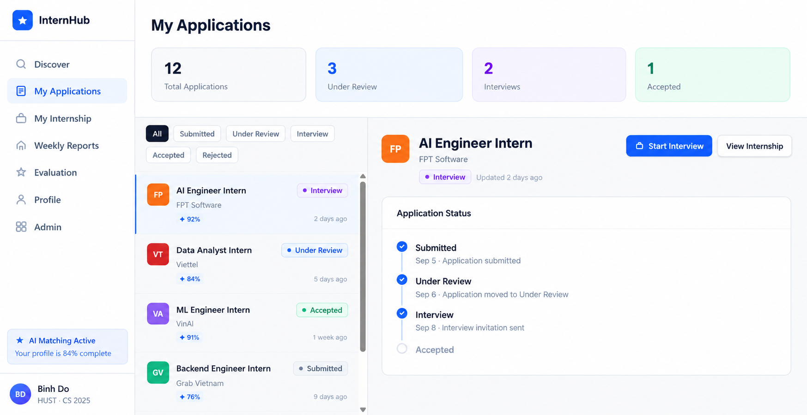
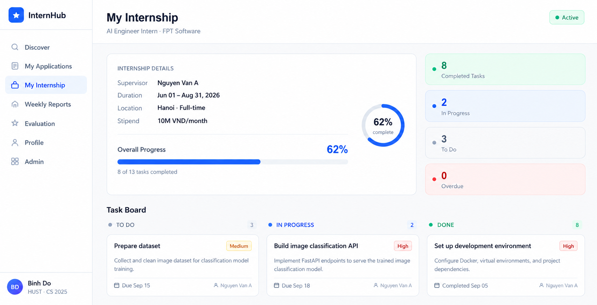
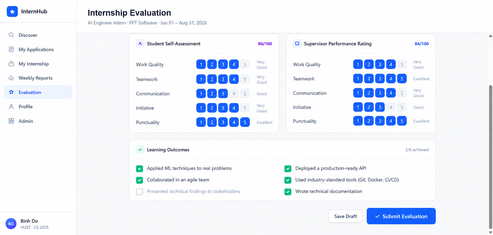
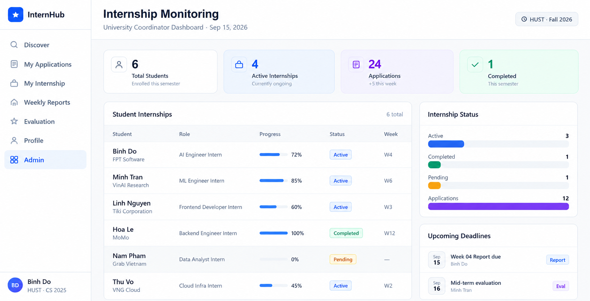

# InternHub

**InternHub is a role-aware internship platform that takes a student from opportunity discovery to an auditable, supervised placement and completion.** It gives students, company staff, supervisors, and administrators one shared workflow without giving any role access to unrelated records.

[Quick start](#getting-started) · [API contract](docs/api/openapi.yaml) · [Architecture](docs/architecture/README.md) · [Documentation](#detailed-documentation)

| Delivery status | Scope |
| --- | --- |
| **Implemented** | Authenticated, role-scoped workflows; student registration with email verification; API-backed web client; PostgreSQL persistence; private document transfers; in-app notifications; Admin user/membership controls; SMTP password recovery; automated checks. |
| **Partial** | No other partial product capability is currently identified. |
| **Deferred** | Optional AI worker and UI controls, token refresh, and multi-instance scheduler deployment. AI endpoints return 503. |

## Product

Internship coordination often spans disconnected postings, applications, status updates, tasks, reports, and evaluations. InternHub makes that lifecycle visible and retains the history needed to understand who changed what.

Discover → Apply → Review → Accept / create placement → Tasks and reports → Assessment → Complete

The system keeps human decisions in control. Its deterministic Match Score explains skill alignment but never screens a student out or makes a hiring decision.

## Requirements and delivery status

| Capability | Primary actors | Outcome | Status |
| --- | --- | --- | --- |
| [Identity and access](docs/requirements/requirements.md#rq-01--enforce-role-and-record-ownership) | All roles | Server-backed sessions, role switching, and role-plus-record authorization. | Implemented |
| [Discovery and matching](docs/requirements/requirements.md#rq-04--discover-and-inspect-opportunities) | Student | Search, filters, saves, and deterministic skill Match Scores for eligible postings. | Implemented |
| [Postings and applications](docs/requirements/requirements.md#rq-03--manage-company-profiles-and-internship-postings) | Student, Company Staff, Admin | Publish opportunities, submit once, retain status history, and accept into one placement. | Implemented |
| [Placement progress](docs/requirements/requirements.md#rq-09--view-and-manage-the-placement-lifecycle) | Student, Supervisor, Admin | Tasks, reporting periods, versioned weekly reports, review feedback, and lifecycle completion. | Implemented |
| [Assessments](docs/requirements/requirements.md#rq-12--submit-a-student-self-assessment) | Student, Supervisor, Admin | Separate student self-assessments and evaluator performance evaluations. | Implemented |
| [Monitoring and notifications](docs/requirements/requirements.md#rq-14--monitor-program-activity-without-changing-source-records) | Admin, all recipients | Read-only aggregates and recipient-scoped in-app notifications. | Implemented |

The [functional specification](docs/requirements/spec.md) and [detailed requirements](docs/requirements/requirements.md) define product rules. The [implemented OpenAPI contract](docs/api/openapi.yaml), controllers, and tests establish the runtime surface. Optional AI explanations and report summaries are deliberately unavailable until a worker exists.

## Use cases

| Student | Company Staff | Supervisor | Admin |
| --- | --- | --- | --- |
| Build a profile, discover and save eligible opportunities, apply, track an application, complete tasks, submit reports, and self-assess. | Create and publish company postings, review company applications, and accept an applicant with placement dates and a supervisor. | Access assigned placements only; create tasks, review reports, and submit performance evaluations. | Monitor program/term activity and administer authorized records across the platform. |
| Access is limited to the student's own records. | Access is limited to the staff member's active company membership. | Access is limited to current placement assignments. | Administrative access remains subject to server-side policy checks. |

~~~mermaid
flowchart LR
  Staff[Company Staff publishes posting] --> Student[Student discovers and applies]
  Student --> Review[Staff/Admin reviews application]
  Review -->|accepted with dates + supervisor| Placement[One active placement]
  Placement --> Supervisor[Supervisor assigns tasks and reviews reports]
  Placement --> Progress[Student updates tasks and submits reports]
  Supervisor --> Assessment[Separate assessments]
  Progress --> Assessment
  Assessment --> Complete[Supervisor/Admin completes or terminates placement]
~~~

See [actors and access rules](docs/requirements/spec.md#2-actors-and-access-rules) and the executable [four-role browser journey](tests/browser/lifecycle.spec.ts).

## User experience

### Discover and track an opportunity

Students find eligible postings, inspect their skill alignment, submit a complete application, and retain a readable status history.

### Execute the placement

Accepted applications create one placement. Students report progress and submit reports; supervisors review and evaluate through separate role-owned records.

### Oversee the program

Administrators use read-only program and term monitoring to understand application, placement, progress, and deadline activity. Staff application review, supervisor report review, notifications, and private-document transfer are covered by the lifecycle and test flow but do not yet have dedicated README visuals.

## Architecture and repository layout

~~~mermaid
flowchart TB
  Browser[Browser] --> Web[Web SPA React 19 + Vite]
  Web -->|REST JSON /api/v1| API[NestJS modular monolith Authorization, use cases, deadline scheduler]
  API -->|transactions| DB[(PostgreSQL System of record)]
  API -->|authorized transfers| Storage[(Private MinIO Document bytes)]
  Worker[Optional AI worker Deferred / not deployed]
  Worker -. future advisory jobs only .-> DB
~~~

- The API authorizes every protected operation by active role and record relationship; client navigation is not a security boundary.
- PostgreSQL transactions retain application transitions, report versions, reviews, and audit-oriented records.
- The API, not the browser, authorizes private document uploads and downloads.
- The web client consumes generated models from the checked OpenAPI contract.

~~~text
apps/
  web/          React, React Router, TanStack Query UI
  api/          NestJS API, services, TypeORM migrations, seed
  worker/       Deferred optional-AI worker placeholder
packages/
  domain/       Shared lifecycle and matching rules
  contracts/    Generated OpenAPI types and client models
docs/           Requirements, UX, architecture, API, and data design
infra/          Container images, nginx baseline, recovery guidance
~~~

Read the [architecture overview](docs/architecture/README.md), [C4 views](docs/architecture/c4.md), and [ADRs](docs/architecture/adr/).

## API and data

The supported API contains **69 implemented REST operations**. It covers identity and health, verified student registration, student profile/discovery, postings/applications, placements/reports/evaluations, private documents, notifications, and monitoring. The complete, generated-contract source is [docs/api/openapi.yaml](docs/api/openapi.yaml); [target-openapi.yaml](docs/api/target-openapi.yaml) is a non-supported design proposal.

~~~mermaid
flowchart LR
  User[Users and roles] --> Profile[Student / supervisor / company profiles]
  Profile --> Posting[Companies and postings]
  Posting --> Application[Applications and status history]
  Application --> Placement[Placement and supervisor assignment]
  Placement --> Progress[Tasks, reporting periods, reports, versions, reviews]
  Placement --> Assessment[Self-assessment and performance evaluation]
  User --> Notice[Notifications and audit events]
  Application --> Documents[Private document metadata]
  Progress --> Documents
~~~

PostgreSQL is the authoritative store for business records, lifecycle history, notifications, and job state. MinIO stores private document bytes; the API resolves authorization before streaming them. View the [full ERD](docs/data/database_design.png) and [database design](docs/database/database-design.md) for tables, constraints, and indexes.

## Engineering quality

Continuous integration runs on every push and pull request. It type-checks, checks architectural boundaries and formatting, verifies generated contract freshness, builds both applications, and executes the test suite.

| Verification | Evidence |
| --- | --- |
| Contract and API consistency | pnpm contracts:check compares controller routes with OpenAPI and generated types. |
| Unit and domain behavior | Jest and Vitest cover API services/controllers, web flows, and shared lifecycle/matching rules. |
| HTTP integration | Disposable embedded PostgreSQL runs migrations and real HTTP requests without touching the development database. |
| Browser workflow | Playwright drives the four-role lifecycle from posting through report revision and placement completion. |
| Private storage | A separate CI job verifies integration against a real MinIO server. |
| Coverage gate | Combined API and web checks enforce 80% statements, branches, functions, and lines. |

Run the same checks locally:

~~~sh
pnpm typecheck
pnpm lint
pnpm format:check
pnpm contracts:check
pnpm build
pnpm test
pnpm test:integration
pnpm exec playwright install --with-deps chromium
pnpm test:browser
pnpm test:coverage
~~~

See the [CI workflow](.github/workflows/ci.yml), [browser journey](tests/browser/lifecycle.spec.ts), and [API verification notes](apps/api/README.md).

## Getting started

Prerequisites: Node.js 22, pnpm 10.34.3, and Docker Compose v2.

~~~sh
pnpm install --frozen-lockfile
cp apps/api/.env.example apps/api/.env
cp apps/web/.env.example apps/web/.env
docker compose up -d
pnpm db:migrate
pnpm db:seed
pnpm dev:api
# In another terminal:
pnpm dev:web
~~~

Open <http://localhost:5173>. Vite proxies /api to port 3000.

Development-only seeded accounts

| Role | Email |
| --- | --- |
| Student | student@internhub.local |
| Company Staff | staff@internhub.local |
| Supervisor | supervisor@internhub.local |
| Admin | admin@internhub.local |

All seeded accounts use InternHub123!. The seed is forbidden in production; never use these credentials outside local development.

For component-specific setup and operations, see [API setup](apps/api/README.md), [web setup](apps/web/README.md), and [deployment and recovery](infra/README.md).

## Detailed documentation

| Area | Primary documentation |
| --- | --- |
| Product and requirements | [Functional specification](docs/requirements/spec.md) and [testable requirements](docs/requirements/requirements.md) |
| UX and design | [Screen inventory](docs/ui/screens.md) and [design system](docs/ui/design-system.md) |
| Architecture | [Architecture index](docs/architecture/README.md), [arc42](docs/architecture/arc42.md), and [ADRs](docs/architecture/adr/) |
| API and contracts | [Implemented OpenAPI](docs/api/openapi.yaml) and [contracts package](packages/contracts/README.md) |
| Data model | [Database design](docs/database/database-design.md) and [ERD](docs/data/database_design.png) |
| Operations | [Infrastructure, deployment, and recovery](infra/README.md) |
