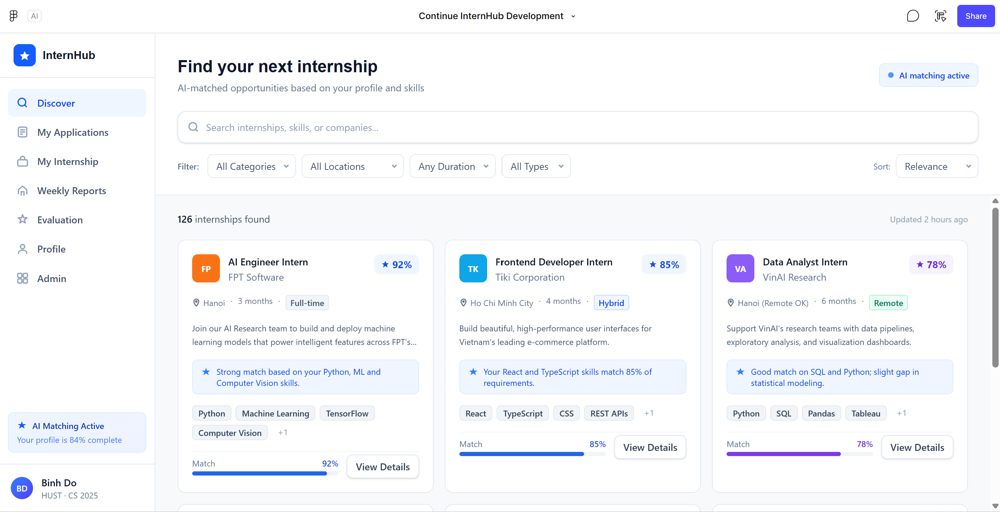
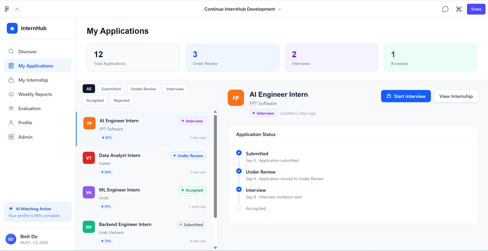
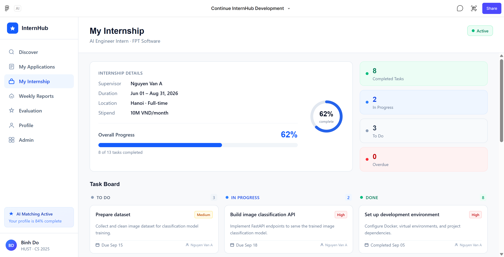
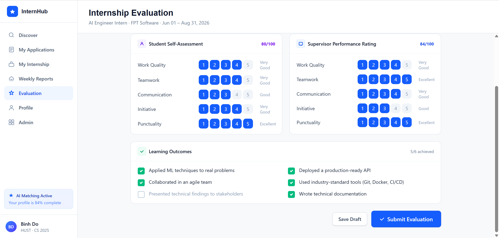
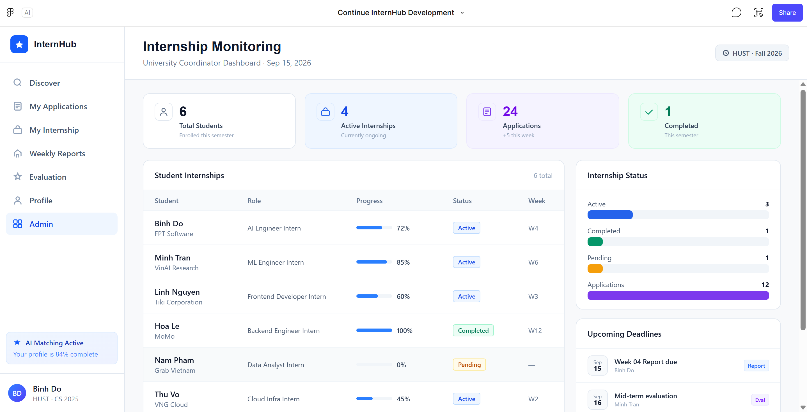
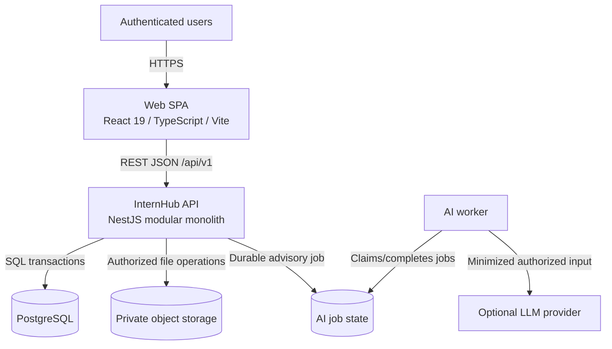

# InternHub - Smart Internship Management System

InternHub is a role-aware platform for the complete internship lifecycle: students discover and apply for opportunities, companies manage postings and applicants, supervisors guide placements, and administrators monitor programs. The current implementation is a **React 19 / Vite frontend prototype** using mock data and local state. The API, worker, shared packages, database, and deployment configuration documented here are the target design rather than running services.

**Author:** Doan Nhat Binh  
**Status:** UI prototype with a documented target architecture

## 1. Project overview

InternHub brings internship discovery, application processing, placement progress, reporting, and evaluation into one transparent workflow. It is designed around role-and-record authorization: a user must have both an appropriate role and a valid relationship to the record they access.

The functional specification is the source of truth. It defines a deterministic, advisory Match Score and keeps AI assistance optional: AI can explain an existing score or summarize a submitted report, but it never makes hiring, task, evaluation, or academic decisions.

## 2. Core features

- **Profiles and opportunities:** students maintain their profile, skills, preferences, and reusable documents; Company Staff and Admins manage company profiles and posting lifecycles.
- **Discovery and matching:** keyword search, filters, sorting, saved opportunities, and a reproducible 0-100 skill-based Match Score with matched and missing skills.
- **Applications:** one application per student and posting, submission snapshots, auditable status history, withdrawal, and controlled review transitions.
- **Placement progress:** acceptance creates one placement; Supervisors/Admins assign tasks, students update progress, and weekly reports retain submission and review history.
- **Independent evaluation:** student self-assessments and Supervisor/Admin performance evaluations remain separate; no combined score or implied academic grade is produced.
- **Monitoring and notifications:** read-only program monitoring for Admins and recipient-scoped in-app notifications for lifecycle events.
- **Optional AI assistance:** authorized, asynchronous explanations and summaries that do not block core workflows or alter source data.

## 3. Actors

| Actor | Primary responsibilities | Access boundary |
| --- | --- | --- |
| **Student** | Maintain a profile, discover and apply for postings, manage placement work, submit reports and self-assessments. | Their own profile, saved postings, applications, placement, tasks, reports, documents, assessments, and notifications. |
| **Company Staff** | Maintain their company and postings; process applications. | Their company's records and its related applications or placements. |
| **Supervisor** | Manage assigned placements, tasks, report reviews, and evaluations. | Explicitly assigned placements only. |
| **Admin** | Administer records and monitor programs. | Administrative scope across relevant records; monitoring itself is read-only. |

## 4. Use Case Diagram

**Primary actors:** Student, Company Staff, Supervisor, and Admin. Each initiates only the goals permitted for their role and authorized records. There are no requirements-level secondary actors: optional AI assistance is system behavior, and an AI provider is an implementation detail rather than a user-facing actor. No actor generalization is shown: Admin has administrative authority, but is not a specialization of Company Staff or Supervisor; role-plus-record authorization remains explicit. The Admin associations shown below are intentional: RQ-01 permits an Admin to administer an action reserved for the responsible role, while RQ-08, RQ-10, RQ-11, and RQ-13 explicitly name Admin as an authorized actor.

```mermaid
flowchart LR
  Student[Student]
  Staff[Company Staff]
  Supervisor[Supervisor]
  Admin[Admin]

  subgraph InternHub[InternHub system boundary]
    direction TB

    subgraph Opportunity[Opportunities and applications]
      Profile([Maintain student profile])
      Discover([Discover opportunities])
      Score([View Match Score])
      Save([Save opportunity])
      Apply([Submit application])
      Track([Track application])
      Withdraw([Withdraw application])
      Company([Maintain company profile])
      Posting([Maintain internship posting])
      Process([Review and decide on application])
    end

    subgraph Placement[Placement, reports, and evaluation]
      ViewPlacement([View placement progress])
      EndPlacement([Complete or terminate placement])
      Assign([Assign task])
      TaskProgress([Update task progress])
      SubmitReport([Submit weekly report])
      ReviseReport([Revise weekly report])
      ReviewReport([Review weekly report])
      SelfAssessment([Submit self-assessment])
      PerformanceEvaluation([Submit performance evaluation])
    end

    subgraph Supporting[Supporting goals]
      Monitor([Monitor program activity])
      Notifications([View notifications])
      MatchExplanation([Request Match Score explanation])
      ReportSummary([Request report summary])
    end
  end

  Student --- Profile
  Student --- Discover
  Student --- Score
  Student --- Save
  Student --- Apply
  Student --- Track
  Student --- Withdraw
  Student --- ViewPlacement
  Student --- TaskProgress
  Student --- SubmitReport
  Student --- ReviseReport
  Student --- SelfAssessment
  Student --- Notifications
  Student --- MatchExplanation

  Staff --- Company
  Staff --- Posting
  Staff --- Process
  Staff --- ViewPlacement
  Staff --- Notifications

  Supervisor --- EndPlacement
  Supervisor --- ViewPlacement
  Supervisor --- Assign
  Supervisor --- ReviewReport
  Supervisor --- PerformanceEvaluation
  Supervisor --- Notifications
  Supervisor --- ReportSummary

  Admin --- Company
  Admin --- Posting
  Admin --- Process
  Admin --- EndPlacement
  Admin --- ViewPlacement
  Admin --- Assign
  Admin --- ReviewReport
  Admin --- PerformanceEvaluation
  Admin --- Monitor
  Admin --- Notifications

```



No `<<include>>` or `<<extend>>` relationship is used here. The requirements describe conditions and state transitions (for example, a non-terminal application may be withdrawn and a revision may follow feedback), not reusable mandatory sub-goals or optional behavior embedded in another use case. Those flows belong in activity, sequence, or state diagrams. `Discover opportunities` and `View Match Score` remain independent Student goals, as RQ-04 and RQ-05 specify them separately. See the authoritative [functional specification](./docs/requirements/spec.md) and the testable [product requirements](./docs/requirements/requirements.md) for lifecycle and authorization rules.

## 5. UI/UX Preview

The prototype uses a role-aware application shell and covers discovery, application tracking, placement progress, evaluation, and administration. The full screen inventory, information architecture, and design system are available in [`docs/ui/`](./docs/ui/).

| Discover opportunities | Applications |
| --- | --- |
|  |  |
| Placement progress | Evaluation |
|  |  |
| Administration | |
|  | |

## 6. Architecture Overview

InternHub targets a three-tier modular monolith. The browser communicates only with the API; authorization, validation, lifecycle rules, transactions, audits, and document access are enforced at the application boundary.



- The **Web SPA** is implemented today as a React/Vite prototype with local mock state.
- The **API**, **worker**, **PostgreSQL**, private object storage, and reverse-proxy deployment are planned components.
- PostgreSQL is the system of record; private storage retains file bytes only. The worker cannot change workflow status, scoring, or evaluations.

Read the [C4 architecture](./docs/architecture/c4.md) for context, containers, and components, and [arc42](./docs/architecture/arc42.md) for decisions, quality requirements, risks, and deployment design.

## 7. Database & API

The target relational model uses PostgreSQL for identity and roles, organizations, postings, applications and immutable status history, placements, tasks, versioned reports, separate assessments, notifications, audits, and durable AI jobs. It preserves key invariants such as one application per student/posting and exactly one placement after acceptance.

The draft REST contract is versioned at `/api/v1` and includes protected endpoints for identity, profiles, documents, companies, postings, applications, placements, reports, evaluations, monitoring, notifications, and optional AI jobs.

- [Database design and ERD](./docs/database/database-design.md)
- [OpenAPI 3.0.3 contract](./docs/api/openapi.yaml)

## 8. Project Structure

```text
apps/
  web/                 React 19, TypeScript, Vite, and Tailwind UI prototype
  api/                 Planned NestJS modular-monolith API
  worker/              Planned durable optional-AI job worker
packages/
  contracts/           Planned shared API DTOs/contracts
  domain/              Planned framework-independent domain rules
infra/                 Planned deployment and platform configuration
docs/
  requirements/        Functional specification and testable requirements
  ui/                  Screen inventory, information architecture, design system
  screenshots/         Prototype UI previews
  architecture/        C4 and arc42 architecture documentation
  database/            PostgreSQL design and ERD
  api/                 OpenAPI contract
```

## 9. Getting Started

### Prerequisites

- Node.js 22+ (the repository pins Node 22 in `.mise.toml`)
- Corepack-enabled pnpm 10.34.3

### Run the web prototype

From the repository root:

```bash
corepack enable
corepack install
pnpm install
pnpm dev:web
```

Vite prints the local URL when the development server starts. Validate the web workspace with:

```bash
pnpm typecheck:web
pnpm build:web
```

The prototype is intentionally frontend-only. It has no initialized backend, database, external integration, or API client yet.

## 10. Documentation

| Area | Document |
| --- | --- |
| Functional source of truth | [Functional specification](./docs/requirements/spec.md) |
| Testable requirements | [Product requirements](./docs/requirements/requirements.md) |
| UI/UX | [UI documentation](./docs/ui/) |
| Architecture | [C4](./docs/architecture/c4.md) and [arc42](./docs/architecture/arc42.md) |
| Data model | [Database design](./docs/database/database-design.md) |
| API contract | [OpenAPI](./docs/api/openapi.yaml) |
| Source layout | [Web application README](./apps/web/README.md) |
