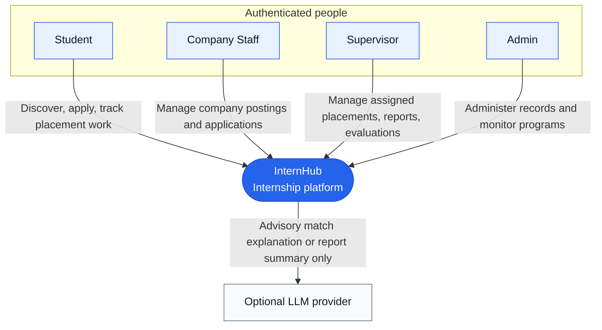
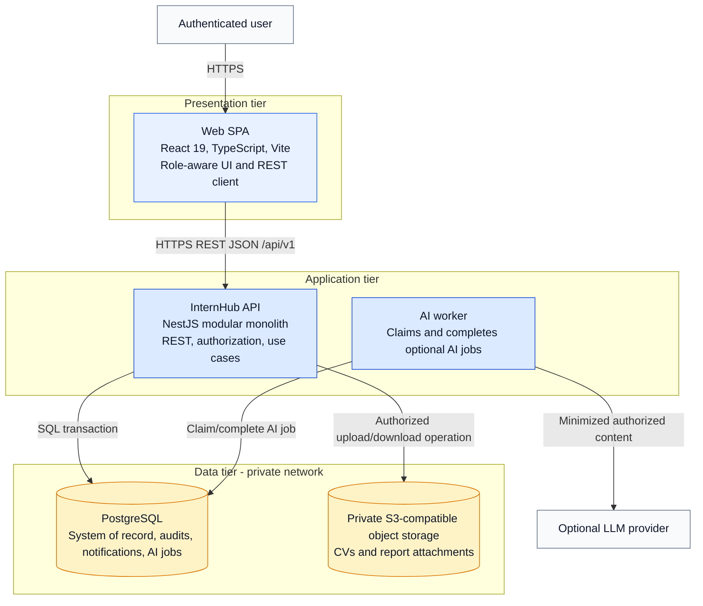
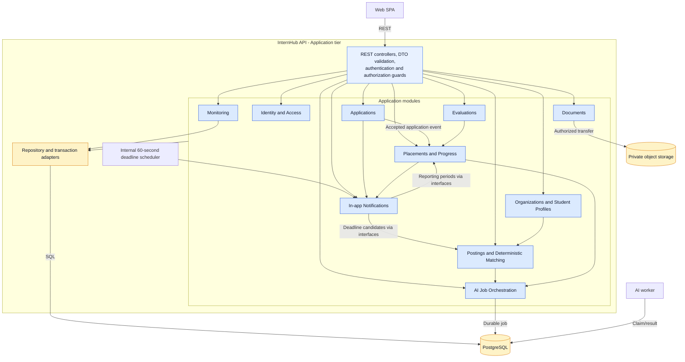

# InternHub C4 Architecture Overview

## Purpose and scope

This is the canonical C4 overview for InternHub. It describes the target architecture that supports the requirements and UI flows in [`docs/requirements/requirements.md`](../requirements/requirements.md) and [`docs/ui/`](../ui/). It is a target design: the current web application is a React/Vite prototype with mock data, while the API, worker, shared packages, and infrastructure are planned.

InternHub uses a three-tier modular-monolith design:

| Tier | Responsibility | Target containers |
| --- | --- | --- |
| Presentation | Role-aware screens, local interaction state, accessibility, and calls to the application boundary. It never makes authorization or business decisions. | Web SPA |
| Application | Authenticates and authorizes requests, coordinates use cases, applies domain rules, creates audit/notification records, and controls data access. | API and AI worker |
| Data | Retains authoritative records and private binary content. It is not directly reachable from the browser. | PostgreSQL and object storage |

Dependencies flow from Presentation to Application to Data. The worker is an Application-tier process: it performs optional AI jobs only and does not become a second source of domain truth.

## C1 - System context

All users enter the system after authentication. The API validates the active role plus record relationship on every protected read and write; navigation visibility in the SPA is only a usability aid. The LLM is optional enrichment, never a decision maker or source record. Email, SMS, push, and other external notification delivery are outside the current scope.

## C2 - Container view and tier mapping

### Container responsibilities and boundaries

| Container | Tier | Owns | Boundary rules |
| --- | --- | --- | --- |
| Web SPA | Presentation | Authenticated shell, role-aware navigation, screens, form state, API client, and display of source versus advisory AI content | Calls only the API. It never reads PostgreSQL/object storage directly or trusts UI visibility as authorization. |
| InternHub API | Application | REST boundary, identity/role/ownership checks, validations, domain use cases, transactions, audit history, in-app notification creation, and scoped file access | The only synchronous entry point for browser actions and the only component that permits data access for a user. |
| AI worker | Application | Polling/claiming durable AI jobs, provider invocation, retry/failure state, and persistence of generated advisory output | Cannot change workflow statuses, scores, tasks, evaluations, or source report/application content. It reads/writes only job and generated-result data it is authorized to process. |
| PostgreSQL | Data | Business records, relationships, history, notification read state, file metadata/object keys, and durable AI-job state | Authoritative relational store; private to application-tier processes. |
| Object storage | Data | Private CVs, optional application documents, and report attachments | Stores bytes only. Metadata, access checks, and time-limited transfer authorization remain API-owned. |

Core user actions use synchronous REST requests. Domain-event notifications are inserted in the same transaction as their triggering application event. The API Notifications module also schedules deadline scans every 60 seconds and inserts deduplicated reminders from the shared calendar, then exposes both through the notification API; no external delivery provider is required. When a user requests AI help, the API authorizes the source data, persists an immutable minimized input snapshot in an AI job, and returns without delaying the core workflow. The SPA can refresh generated-result status while the worker processes it.

## C3 - API component view

This diagram zooms into the API container. Components are application modules, not separately deployed services; they communicate through application-service interfaces and in-process domain events rather than direct cross-module table access.

### Component responsibilities

| Component | Responsibilities and invariants |
| --- | --- |
| Identity and Access | Authenticated identity, active role, and centralized role-plus-relationship policy checks. |
| Organizations and Student Profiles | Student identity/education, skills, preferences, reusable documents metadata, company membership, company profile, and supervisor assignment context. |
| Postings and Deterministic Matching | Posting lifecycle and eligibility, discovery filters, saved opportunities, and reproducible 0-100 skill-score breakdowns. AI may explain a calculated result but cannot alter it. |
| Applications | One application per student/posting, submission snapshot, allowed transitions, immutable status history, and exactly-once placement creation on acceptance. |
| Placements and Progress | Placement lifecycle, task assignment/status ownership, immutable reporting periods, private weekly-report drafts/attachments, retained submitted versions, and version-conditional reviews. |
| Evaluations | Separate student self-assessments and supervisor/admin evaluations; no combined score or academic-grade calculation. |
| Monitoring | Read-only, scoped aggregates for program/term activity, deadlines, and drill-through links. It does not edit source records. |
| In-app Notifications | Recipient-scoped notification records and read/unread state for application, task, report-feedback/revision, and deadline events. |
| Documents | File metadata validation and authorized object-storage operations. |
| AI Job Orchestration | Authorized, minimized requests for match explanations and report summaries; immutable minimized input snapshots, requester-scoped reuse, leased processing, bounded recovery and pending/processing/succeeded/failed job state. |

## Requirement and UI-flow mapping

| Requirement | UI flow | Primary application component(s) |
| --- | --- | --- |
| RQ-01 | Role-aware navigation, protected record/detail flow | Identity and Access; every protected module |
| RQ-02 | Student profile, skills, preferences, reusable documents | Organizations and Student Profiles; Documents |
| RQ-03 | Company profile, posting editor, publish/close/archive | Organizations; Postings and Deterministic Matching |
| RQ-04 | Discover, filter, sort, and posting detail | Postings and Deterministic Matching |
| RQ-05 | Match-score display/sort and breakdown | Postings and Deterministic Matching; AI Job Orchestration |
| RQ-06 | Save and remove an opportunity | Postings and Deterministic Matching |
| RQ-07 | Apply, documents, application detail/history | Applications; Documents |
| RQ-08 | Applicant review, transition history, acceptance to placement | Applications; Placements; In-app Notifications |
| RQ-09 | Placement overview and lifecycle completion/termination | Placements and Progress |
| RQ-10 | Task assignment and student progress updates | Placements and Progress; In-app Notifications |
| RQ-11 | Weekly-report draft, submit, review, revision, version history | Placements and Progress; Documents; In-app Notifications; AI Job Orchestration |
| RQ-12 | Student self-assessment | Evaluations |
| RQ-13 | Supervisor/admin performance evaluation | Evaluations; Identity and Access |
| RQ-14 | Read-only program/term monitoring and drill-through | Monitoring |
| RQ-15 | Notification panel/inbox and authorized deep links | In-app Notifications; Identity and Access |
| RQ-16 | On-demand AI explanation or report summary with fallback | AI Job Orchestration; AI worker; Postings or Placements |

## Detailed views

The existing files in [`docs/architecture/c4/`](./c4/) remain supplementary, earlier implementation-oriented views. Where an older diagram depicts external notification delivery or AI-driven workflow behavior, the requirements and this document take precedence until that detailed view is reconciled.

## Audit-refined boundaries

The API is the only browser data-transfer entry point, including file bytes: upload/download URLs point to authenticated API content routes, not storage. The Documents adapter streams private storage bytes and rechecks record access on each transfer. Only the reverse proxy is public.

Identity owns current-session active-role rotation; Organizations owns eligible-supervisor lookup and assignment commands/history, coordinating through Placements' locked Active-placement interface. Placements owns reporting periods. Notifications owns the internal scheduler and consumes deadline candidates through module interfaces in a shared transaction; the separate AI worker remains AI-only and cannot create notifications. AI-job storage includes immutable minimized inputs so its worker needs no business-table access. See [behavior rules](../design/behavior-rules.md) for invariants and [traceability](../design/traceability.md) for acceptance scenarios.
