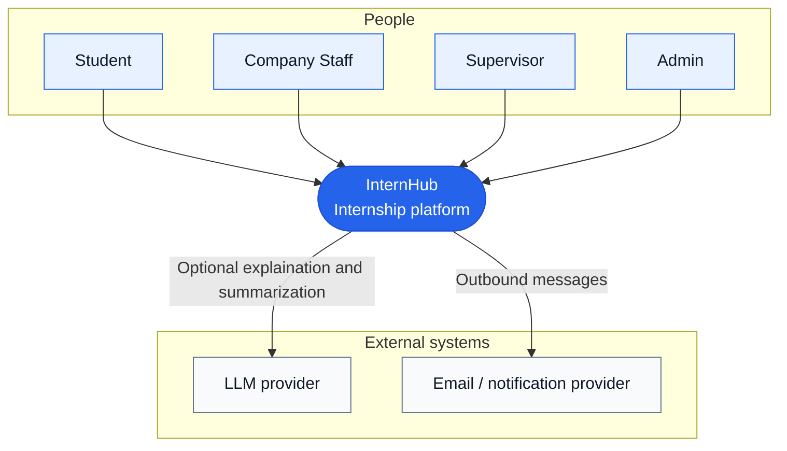

# C4 Level 1 — System Context

All user interactions use HTTPS. Students discover, apply, and submit reports. Company Staff manage their company's openings and applications. Supervisors manage placements; Admins administer the platform.
