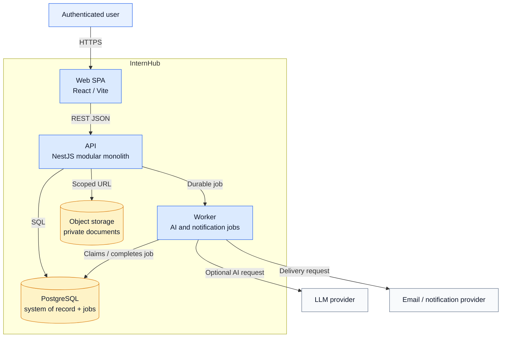

# C4 Level 2 — Container View

The SPA is the only browser-facing application. The API owns synchronous business operations; the Worker handles jobs after commits so external latency does not block the user flow.
