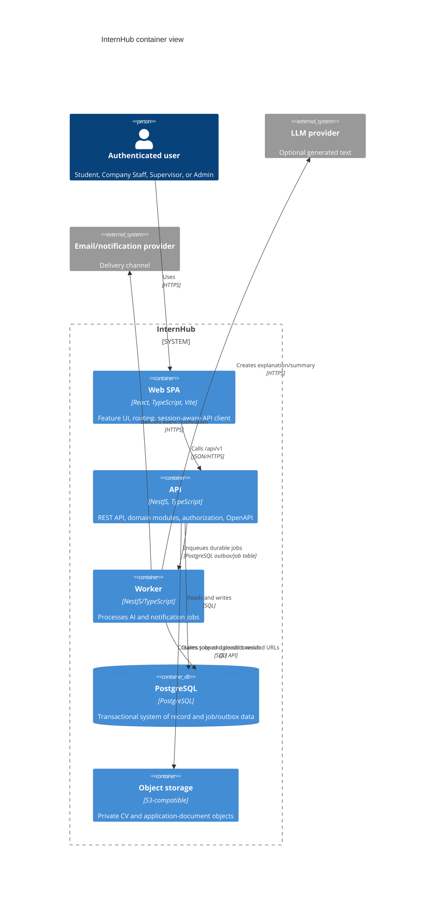

# C4 Level 2 — Container View

```mermaid
C4Container
  title InternHub container view
  Person(user, "Authenticated user", "Student, Company Staff, Supervisor, or Admin")
  System_Boundary(system, "InternHub") {
    Container(web, "Web SPA", "React, TypeScript, Vite", "Feature UI, routing, session-aware API client")
    Container(api, "API", "NestJS, TypeScript", "REST API, domain modules, authorization, OpenAPI")
    Container(worker, "Worker", "NestJS/TypeScript", "Processes AI and notification jobs")
    ContainerDb(db, "PostgreSQL", "PostgreSQL", "Transactional system of record and job/outbox data")
    Container(storage, "Object storage", "S3-compatible", "Private CV and application-document objects")
  }
  System_Ext(llm, "LLM provider", "Optional generated text")
  System_Ext(notification, "Email/notification provider", "Delivery channel")
  Rel(user, web, "Uses", "HTTPS")
  Rel(web, api, "Calls /api/v1", "JSON/HTTPS")
  Rel(api, db, "Reads and writes", "SQL")
  Rel(api, storage, "Creates scoped upload/download URLs", "S3 API")
  Rel(api, worker, "Enqueues durable jobs", "PostgreSQL outbox/job table")
  Rel(worker, db, "Claims jobs and persists result", "SQL")
  Rel(worker, llm, "Creates explanation/summary", "HTTPS")
  Rel(worker, notification, "Delivers event notification", "HTTPS")
```

