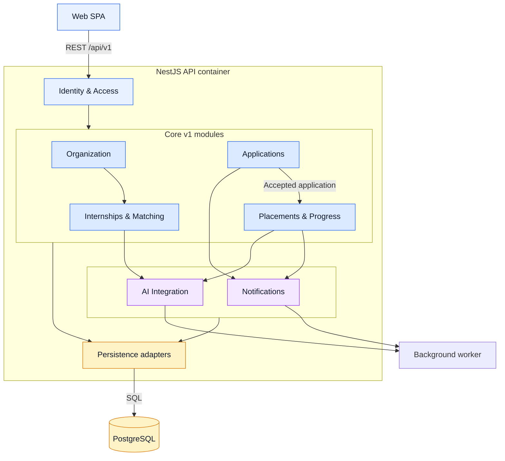

# C4 Level 3 — API Component View

This diagram zooms into the **NestJS API** container from the container view. The SPA has feature boundaries documented in the [refactor blueprint](../refactor-blueprint.md); it is not mixed into this container-level view.

Dependencies cross modules only through application-service interfaces or domain events. `Applications` emits an accepted-application event consumed by `Placements & Progress`; it does not create task/report records itself. AI and notification work is queued as durable jobs for the Worker.
