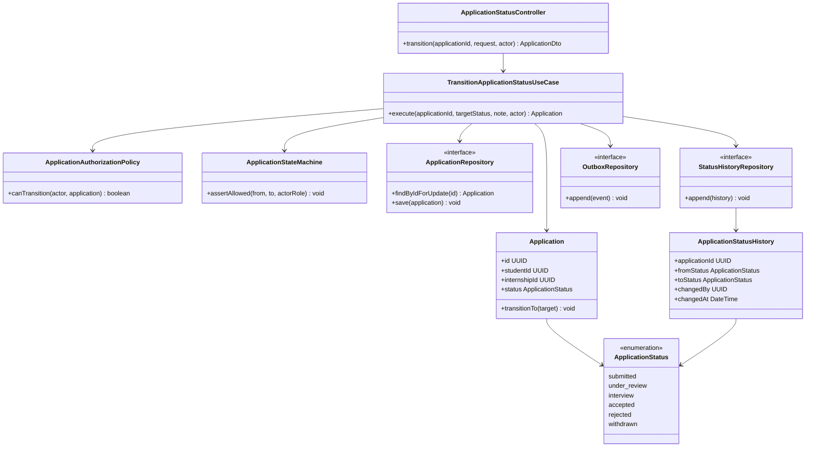

# C4 Level 4 — Application Status Transition Code Diagram

This UML class diagram zooms into the **Application Status Transition** component within the API's Applications module. It is a target implementation design, not a claim that these classes exist in the current frontend prototype.

The use case performs authorization, validates the transition, updates the application, appends history, and appends an outbox notification event in one database transaction. Repository interfaces keep the domain/application logic independent of PostgreSQL and NestJS infrastructure.

