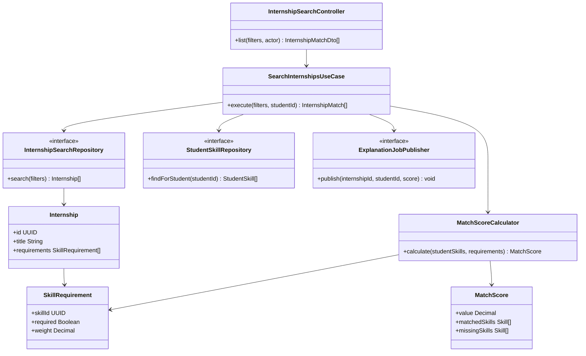

# C4 Level 4 — Discovery & Matching Code Diagram

This code-level view zooms into the deterministic matching component. Search and Match Score do not depend on the LLM; the explanation request is an optional asynchronous side effect.

`MatchScoreCalculator` is a pure domain service: identical skill inputs and requirement weights always produce the same score and breakdown. `ExplanationJobPublisher` runs only after a valid score has been returned.

