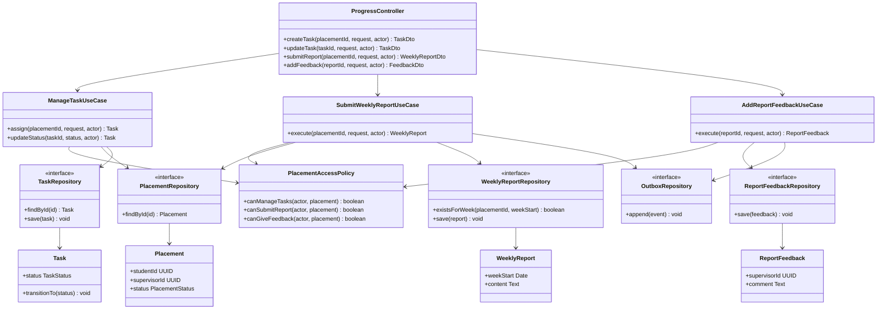

# C4 Level 4 — Internship Progress Code Diagram

This code-level view covers task assignment/status updates, weekly-report submission, and supervisor feedback for an active placement.

The API validates placement ownership and weekly-report uniqueness before writing. Report submission and feedback append durable events so summaries and notifications can run asynchronously without delaying the core workflow.

