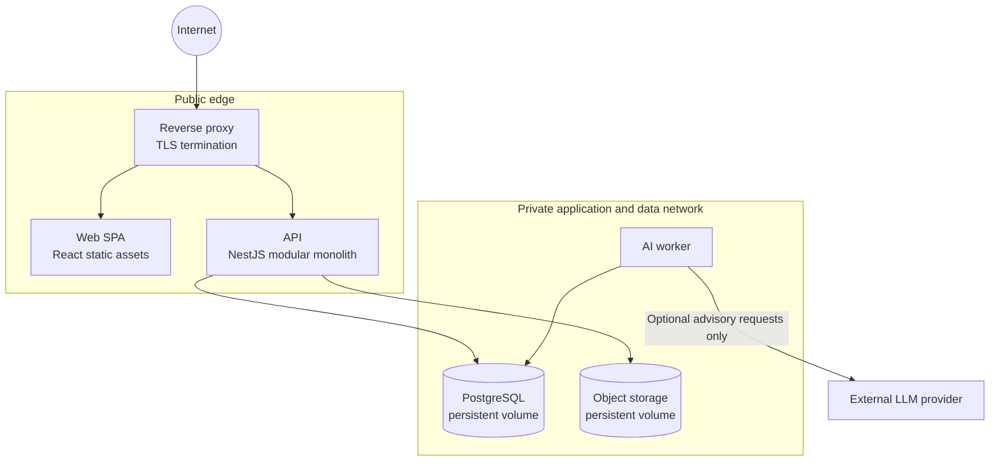

# Deployment View

This supplementary view expands the deployment baseline in the [canonical C4 overview](../c4.md). It supports the three-tier architecture without adding external notification delivery.

Only the reverse proxy exposes a public port. PostgreSQL, object storage, the worker, and provider credentials remain private. The API is the sole browser-facing application boundary; the worker processes durable AI jobs and never sends email, SMS, push, or other external notifications.
