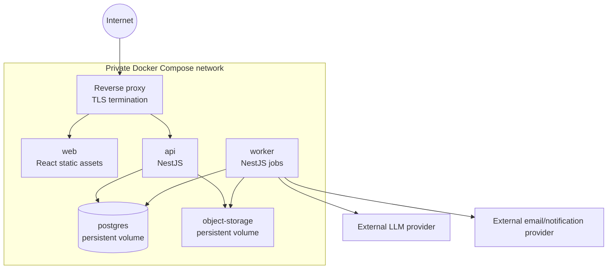

# C4 Deployment View — Docker Compose Baseline

Only the reverse proxy exposes ports. Database credentials, JWT signing key, AI credentials, and storage credentials are injected as secrets/environment configuration and are never committed.

