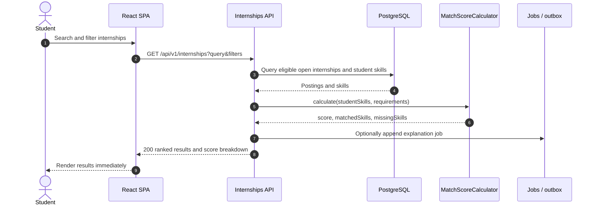
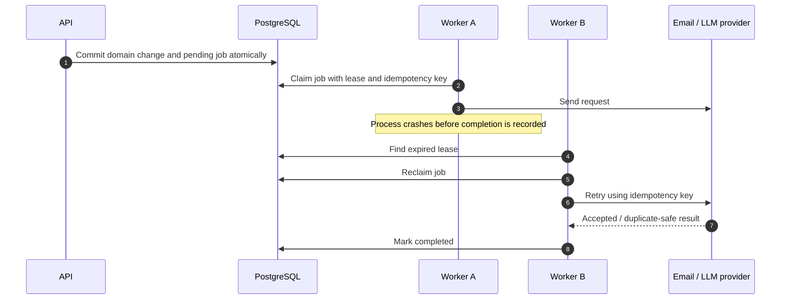
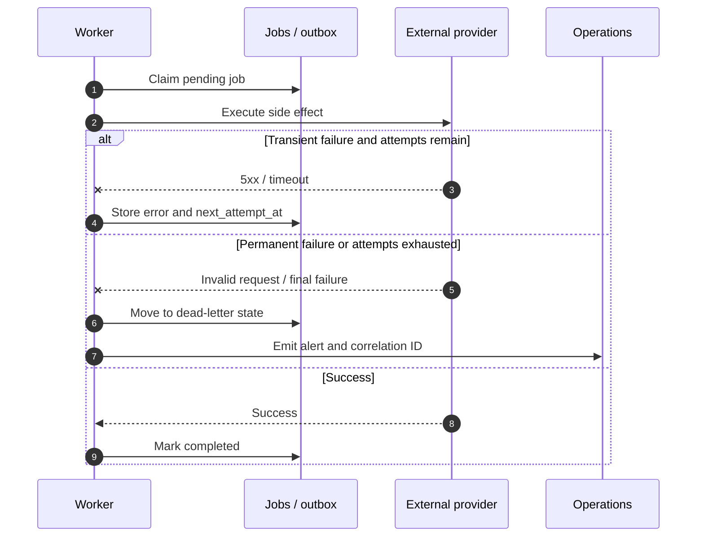

# Runtime Sequences

These are **target-production** interactions. The current React/Vite application is a mock-data prototype and does not yet make these calls.

## 1. Happy path — internship discovery and deterministic match



The Match Score never waits for an LLM; an explanation is optional enrichment.

## 2. Failure path — AI explanation fails without failing search

```mermaid
sequenceDiagram
  autonumber
  participant Worker
  participant Jobs as PostgreSQL jobs/outbox
  participant AI as AI adapter
  participant LLM as LLM provider
  participant Match as Match-score record

  Worker->>Jobs: Claim explanation job (lease)
  Worker->>AI: Generate minimized explanation input
  AI->>LLM: Request explanation
  LLM--x AI: Timeout or provider error
  AI-->>Worker: Retryable failure
  Worker->>Jobs: Record attempt; schedule exponential retry
  Worker->>Match: Keep explanation null and score available
  Note over Jobs,Match: Student can still use deterministic results.
```

## 3. Worker crash during a durable job



An integration must support an idempotency key, or the worker must persist a provider-delivery identifier before retrying, to prevent duplicate messages.

## 4. Retry, compensation, and dead-lettering



Compensation applies only to external side effects that can be safely reversed (for example, canceling a queued notification). A committed application status, audit entry, task, or report is not rolled back merely because enrichment or delivery failed.
