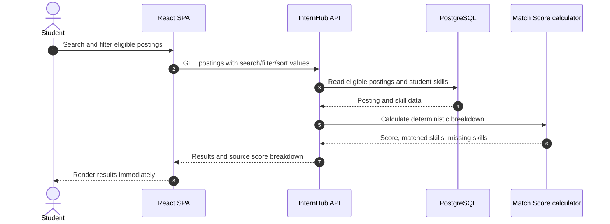
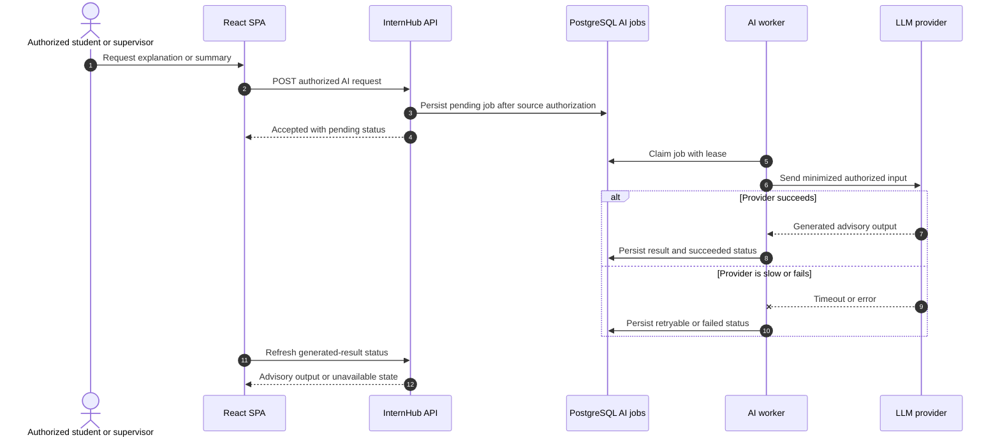
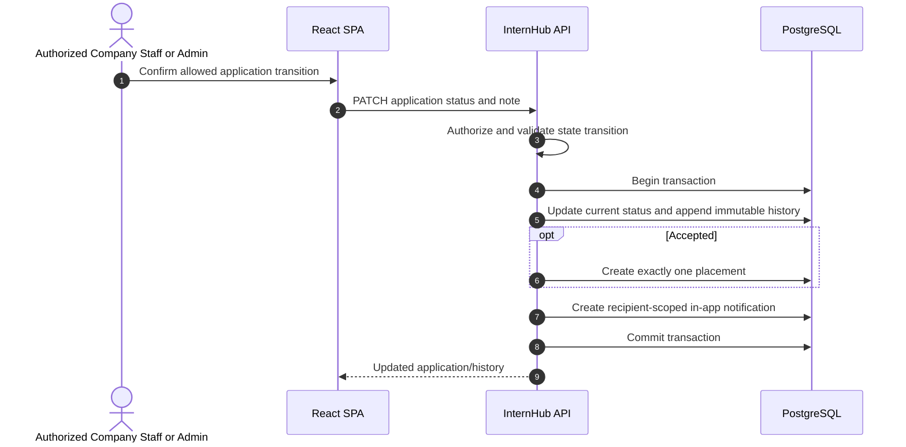

# Runtime Sequences

These runtime interactions expand the [canonical C4 overview](../c4.md). The React/Vite application calls the implemented API for core workflows; the optional-AI sequence remains deferred because no worker is deployed.

## 1. Synchronous discovery and deterministic Match Score

Search and deterministic scoring never wait for AI. The score remains advisory and cannot change opportunity visibility, application eligibility, or a hiring decision.

## 2. Requested AI enrichment and fallback

The original report and deterministic score breakdown remain available in both outcomes. A failed job never rolls back a source record or blocks a core workflow.

## 3. Transactional application change and in-app notification

The notification record is committed with the event that caused it; no worker or external delivery provider is involved.
