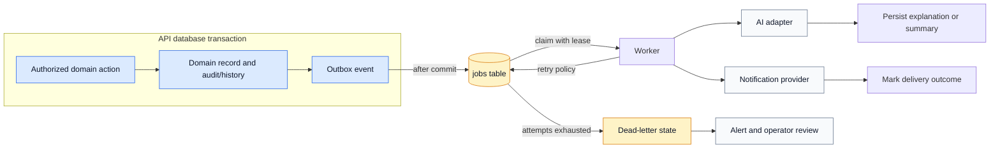

# Domain Event to Durable Job Flow

This is InternHub's equivalent of a trigger-to-flow binding diagram. Domain triggers bind to durable job types rather than compile to a runtime manifest.

| Domain trigger | Durable job | Consumer outcome |
| --- | --- | --- |
| Match score returned | `generate_match_explanation` | Save optional explanation; deterministic score remains usable. |
| Application status changed | `deliver_status_notification` | Create/deliver notification; preserve audit history on failure. |
| Weekly report submitted | `summarize_weekly_report` | Save optional AI summary; raw report remains usable. |
| Feedback or task assigned | `deliver_progress_notification` | Notify the placement student. |

The transaction commits the business data and outbox event together. Jobs are materialized and consumed only after commit, preventing an external side effect for a transaction that later rolls back.
