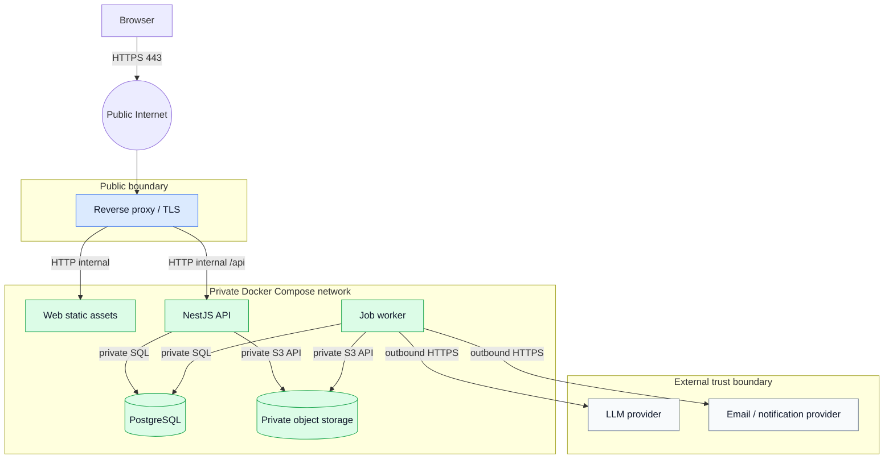

# Network and Trust-Boundary View

Only the reverse proxy exposes a public port. Database, storage, worker, and provider credentials are secrets; they are neither bundled into the SPA nor committed to the repository.
