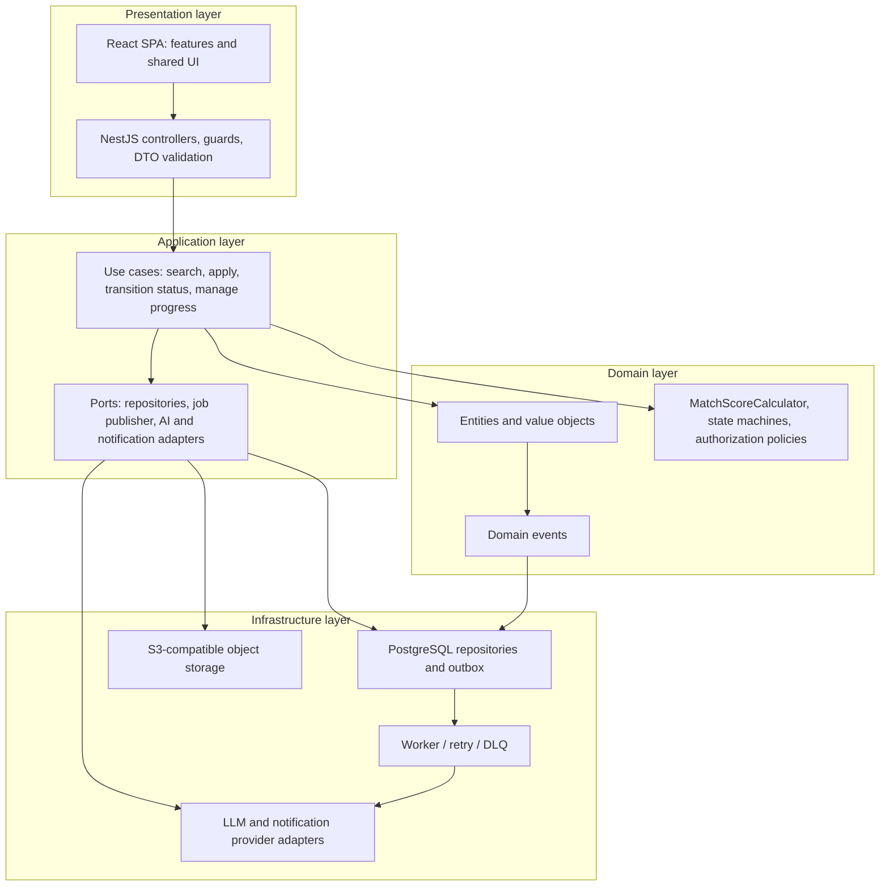

# Layered Architecture View

Dependencies point inward: the domain is independent of NestJS, PostgreSQL, React, and external providers. Infrastructure implements interfaces owned by the application/domain boundary.
