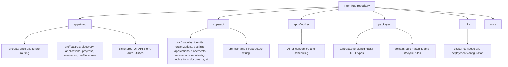

# Target Code Structure

This supplementary repository view describes the implemented boundaries. The web application, API, shared packages, and infrastructure are in use; only the optional-AI worker remains deferred.

The Presentation tier is `apps/web`. The Application tier is `apps/api` plus the AI-only `apps/worker`; `packages/domain` keeps framework-independent rules. PostgreSQL/object-storage adapters belong to the API's infrastructure wiring and remain private to the application tier.
