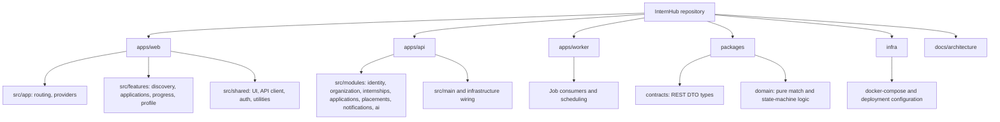

# Target Code Structure

The React/Vite prototype now lives in `apps/web/` and is split into `app`, feature, shared UI, and style folders while retaining frontend mock data. The API, worker, package, and infrastructure portions remain planned boundaries.
