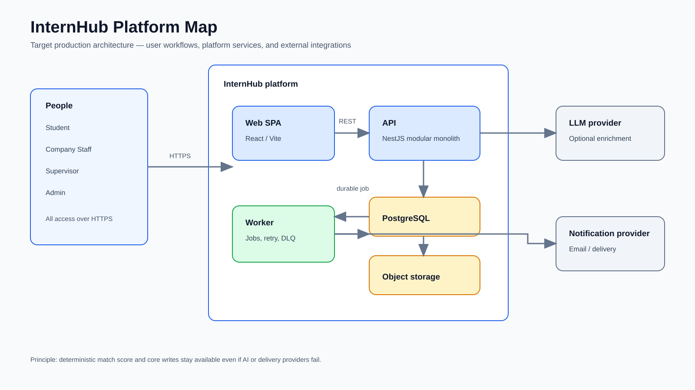
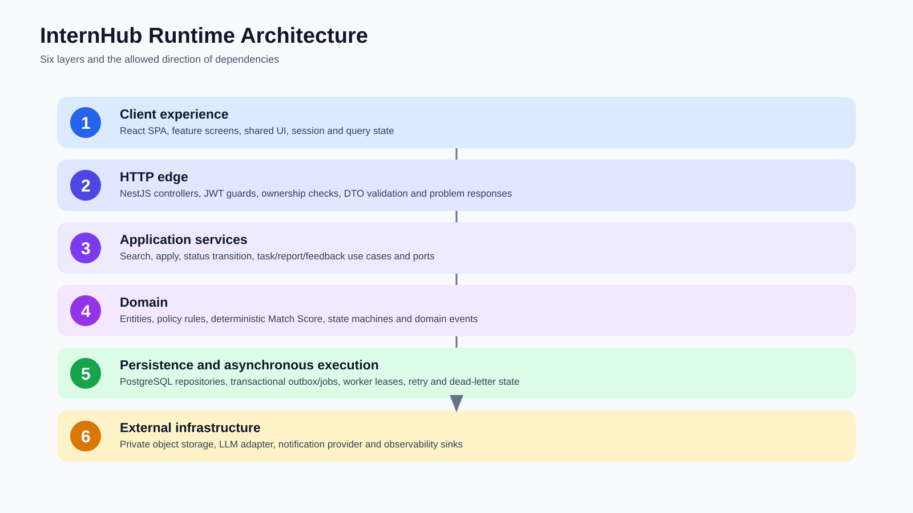

# Static Architecture Assets

These SVG assets are deterministic, editable source-controlled diagrams rather than generated raster images.

## Platform map

## Runtime architecture

The runtime image presents six layers: client experience, HTTP edge, application services, domain, persistence/asynchronous execution, and external infrastructure.
