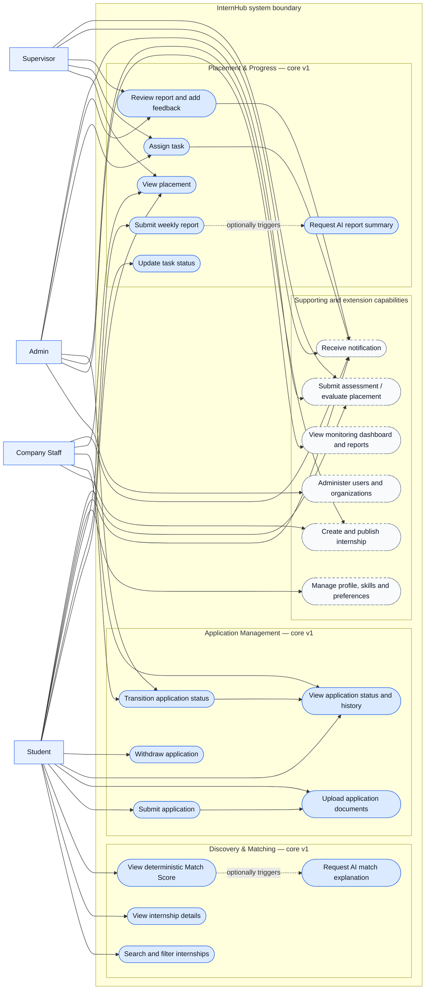

# Use-Case View

This Mermaid flowchart uses a system boundary to represent a UML-style use-case diagram. Solid use cases are v1 core capabilities; dashed use cases are supporting or planned extensions.

## Key authorization rules

| Use case | Primary actor and rule |
| --- | --- |
| Submit/withdraw application | Student owns the application. |
| Transition application status | Company Staff owns the posting's company, or Admin. |
| Assign task / review report | Assigned Supervisor, or Admin. |
| Update task / submit report | Student owns the active placement. |
| Create/publish internship | Company Staff belongs to the company, or Admin. |

AI explanation and report summary are optional asynchronous enrichments. They never decide a match, workflow status, evaluation, or authorization outcome.
