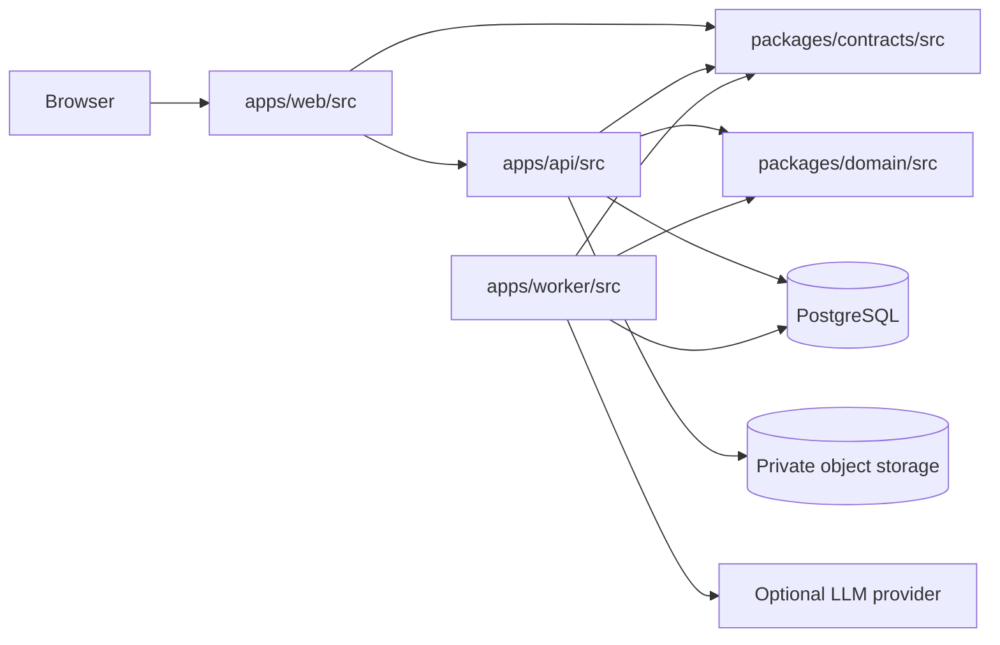

# Code Structure

## Purpose and status

This document defines the target repository and source-code boundaries for InternHub. It implements the C3 component boundaries in [C4](./c4.md), the modular-monolith strategy in [arc42](./arc42.md), the REST boundary in [OpenAPI](../api/openapi.yaml), and aggregate ownership in the [database design](../database/database-design.md).

It is an incremental target structure. The current `apps/web` React/Vite prototype is already feature-oriented and is retained as the frontend baseline. `apps/api`, `apps/worker`, `packages/contracts`, and `packages/domain` are planned packages; their trees describe where implementation belongs when each package is initialized.

## Repository structure

```text
.
├── apps/
│   ├── web/
│   │   ├── src/                    # all web application source
│   │   ├── public/                 # optional static delivery assets only
│   │   ├── index.html              # Vite static entry document
│   │   ├── package.json
│   │   └── vite.config.ts
│   ├── api/
│   │   ├── src/                    # all API application source
│   │   ├── package.json
│   │   └── README.md
│   └── worker/
│       ├── src/                    # all worker application source
│       ├── package.json
│       └── README.md
├── packages/
│   ├── contracts/
│   │   ├── src/                    # all contract package source
│   │   ├── package.json
│   │   └── README.md
│   └── domain/
│       ├── src/                    # all domain package source
│       ├── package.json
│       └── README.md
├── infra/                           # deployment/configuration, not application source
├── docs/                            # documentation and design artifacts
├── package.json
└── pnpm-workspace.yaml
```

Every executable or application source file belongs under the owning application's or package's `src/` directory. Files outside `src/` are limited to package manifests and lockfiles, build or tool configuration, static delivery files, infrastructure definitions, and documentation. In particular, API controllers, migration runners, worker consumers, scripts imported by an application, contract generators, and domain rules must not be placed beside `package.json`.

## Frontend organization

`apps/web/src` keeps its existing `app`, `features`, `shared`, and `styles` roots. The prototype's local state and mock data remain in place until their screen is migrated to the REST API; no rewrite or wholesale feature rename is required.

```text
apps/web/src/
├── app/                             # bootstrap, providers, shell, routing/navigation
├── features/
│   ├── identity/                    # authenticated identity and active-role experience
│   ├── student-profile/             # student profile, skills, preferences
│   ├── organizations/               # company profile and staff-facing organization views
│   ├── postings/                    # discovery, posting detail/editor, saves, match display
│   ├── applications/                # submission, application history, staff review
│   ├── placements/                  # placement lifecycle, tasks, reports and reviews
│   ├── evaluations/                 # self-assessment and performance evaluation
│   ├── monitoring/                  # read-only program/term monitoring
│   ├── notifications/               # notification inbox and read state
│   ├── documents/                   # authorized upload, completion, and download flows
│   └── ai-assistance/               # advisory result request and status display
├── shared/
│   ├── api/                         # REST transport, generated-contract integration, errors
│   ├── auth/                        # session and active-role client state
│   ├── ui/                          # reusable presentational controls
│   ├── lib/                         # framework-neutral client utilities
│   └── types/                       # non-feature-specific UI types
└── styles/                          # global CSS and design tokens
```

A feature may add `routes`, `screens`, `ui`, `api`, and `model` subdirectories when it needs them. The feature owns its route/screen composition, feature-specific API adapter, client state, and UI; it exports a deliberate public feature entry point rather than exposing internal files.

| Existing prototype folder | Incremental target ownership |
| --- | --- |
| `features/discovery` | `features/postings` (discovery, detail, saves, deterministic match display) |
| `features/applications` | `features/applications` |
| `features/progress` | `features/placements` (placement, tasks, reports, reviews) |
| `features/evaluation` | `features/evaluations` |
| `features/profile` | `features/student-profile` and `features/organizations` as responsibilities separate |
| `features/admin` | `features/monitoring` |

The current `app/AppShell.tsx`, screen callbacks, and mock data are valid prototype implementation details. Routing, session state, and API-backed feature adapters are introduced per migrated feature. Legacy interview screens are not a target API feature because AI interviews are outside the approved product scope.

## Backend and package organization

### API modular monolith

```text
apps/api/src/
├── main.ts                          # NestJS bootstrap
├── app.module.ts                    # composition root only
├── infrastructure/                  # configuration, database, storage, observability wiring
└── modules/
    ├── identity/
    ├── organizations/
    ├── postings/
    ├── applications/
    ├── placements/
    ├── evaluations/
    ├── monitoring/
    ├── notifications/
    ├── documents/
    └── ai-jobs/
        ├── presentation/            # controllers, request/response DTO mapping, guards
        ├── application/             # commands, queries, use cases, module interfaces
        ├── domain/                  # aggregate-specific policy and domain events
        └── infrastructure/          # repositories and external adapters private to module
```

`organizations` owns company, staff-membership, supervisor-assignment context, and student profile data. `postings` owns posting lifecycle, discovery, saves, and deterministic matching projections. `placements` owns placement lifecycle, tasks, reports, report versions, and reviews. The remaining modules own the aggregates named in C3 and exposed through the corresponding OpenAPI tags. `monitoring` is read-only. `notifications` writes event records in source-change transactions and owns `application/deadline-scheduler.ts`, an API lifecycle service scanning every 60 seconds. It reads deadline candidates through Postings/Placements application interfaces and inserts deduplicated reminders with shared transaction/source locks.

The API `infrastructure` directory contains cross-cutting composition and adapters only; business use cases stay inside their owning module. A module-specific repository is private to that module and is not an application-wide data-access shortcut.

### AI worker

```text
apps/worker/src/
├── main.ts                          # worker bootstrap and lifecycle
├── application/                     # claim, retry, and complete AI-job use cases
├── consumers/                       # durable AI-job consumer/handler
├── infrastructure/                  # job-store and LLM-provider adapters
└── observability/                   # worker metrics and structured logging
```

The worker processes only authorized `ai_jobs` for match explanations and submitted-report summaries. It may claim a job, invoke the provider with its persisted immutable minimized input snapshot, and persist the advisory result or bounded failure state. It cannot change postings, applications, placements, tasks, reports, evaluations, match scores, notifications, or workflow status.

### Shared packages

```text
packages/contracts/src/
├── generated/                       # OpenAPI-derived REST types, if generation is adopted
├── api/                             # hand-maintained contract helpers, if required
└── index.ts                         # public package exports

packages/domain/src/
├── matching/                        # deterministic score calculation and breakdowns
├── lifecycle/                       # pure application/placement/report transition rules
├── value-objects/                   # shared framework-independent concepts
└── index.ts                         # public package exports
```

`packages/contracts` represents the published REST boundary and stays aligned with `docs/api/openapi.yaml`; it contains no NestJS, React, database, storage, or provider code. `packages/domain` contains deterministic, framework-independent rules and values. It does not query databases, perform I/O, read HTTP requests, or decide authorization.

## Dependency rules



1. The browser calls the versioned REST API only. It never connects to PostgreSQL or object storage, and object keys are never public URLs.
2. A frontend feature may import its own files, `shared`, and public exports from `packages/contracts`. It must not import another feature's internals; cross-feature composition occurs in `app` or through a published feature entry point.
3. `shared` is dependency-downward: it cannot import a feature. Reusable UI remains presentational and does not contain authorization or product workflow decisions.
4. API controllers validate and authorize at the REST boundary, then call the owning module's application interface. API modules collaborate through explicit application-service interfaces or domain events, never by importing another module's repository or reading/writing its tables directly.
5. Database, object-storage, and LLM adapters are private infrastructure. The API owns user-authorized document transfers and authoritative transactional writes. The worker has only the job/result persistence access needed to process AI jobs.
6. `packages/contracts` may be consumed by the web, API, worker, and tests, but imports no application/package implementation. `packages/domain` may be consumed by API, worker, and tests; it imports no framework or I/O adapter.
7. Generated AI output is advisory. It is displayed separately from source records and cannot influence eligibility, deterministic scores, lifecycle transitions, tasks, evaluations, or completion decisions.

## Validation checklist

- Match the API module list and ownership to the C3 component view, OpenAPI tags, and database aggregates.
- Preserve the existing web feature folders and use the mapping table when migrating a screen; do not create a parallel frontend architecture.
- Ensure every new executable/application source path documented here is below the owning `src/` directory.
- Render this document in a Mermaid-capable Markdown preview and verify the internal documentation links.

## Audit-refined source ownership

| Module/path | Required design responsibility |
| --- | --- |
| `apps/api/src/modules/identity/application/` | Session-version validation and setActiveRole token rotation. |
| `apps/api/src/modules/organizations/application/` | getMySkills, canonical skill resolution, eligible-supervisor query, Admin assignment commands/history; use Placements interface for lifecycle lock. |
| `apps/api/src/modules/applications/application/` | Acceptance command normalization/replay comparison; atomic placement, assignment, calendar, history and notification creation. |
| `apps/api/src/modules/placements/application/` | Reporting-period generation/query, private draft/attachment projections, version-conditional review under locks. |
| `apps/api/src/modules/notifications/application/deadline-scheduler.ts` | API-owned minute scan, deadline candidate interfaces and deduplicated reminder insertion; no public scheduler endpoint. |
| `apps/api/src/modules/documents/infrastructure/` | API streaming storage adapter; browser URLs target Documents content controllers with current authorization, never storage. |
| `apps/api/src/modules/ai-jobs/application/` | Consistent authorized source snapshot, fingerprint, requester-scoped reuse and polling authorization. |
| `apps/worker/src/application/` | Fenced 120-second claims, 60-second provider timeout, three-attempt retries and expired-lease recovery; job store only. |
| `packages/domain/src/matching/` | Pure skill-v1 formula, normalization and sort rules with the published example vectors. |

See [behavior rules](../design/behavior-rules.md) and [acceptance traceability](../design/traceability.md). These are target source paths; no runtime implementation is implied.
