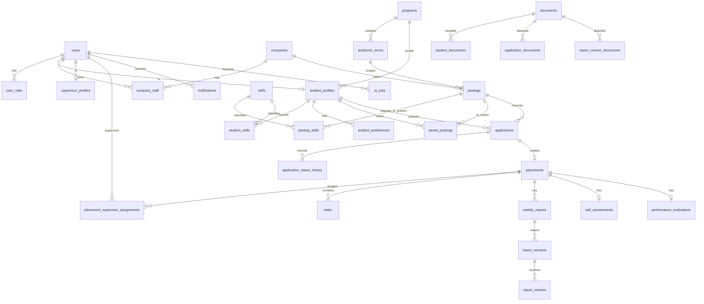

# InternHub Database Design

## Purpose and scope

This is the target PostgreSQL data model for the modular-monolith API described in [C4](../architecture/c4.md). It supports the authenticated UI flows in [screens](../ui/screens.md) and requirements RQ-01–RQ-16. PostgreSQL is the authoritative store for business data, immutable history, notifications, and AI-job state. Private object storage holds document bytes only; it is not a database or an API authority.

The companion [`../data/internship_platform.dbml`](../data/internship_platform.dbml) is the renderable form of this target schema and must remain consistent with it. In particular, the target has multi-role users and company memberships, does not persist AI interviews or AI screening scores, and keeps self-assessments separate from performance evaluations.

## Conventions

- All identifiers are `uuid`; generated identifiers use `gen_random_uuid()`.
- All timestamps are `timestamptz`, stored in UTC. Product dates are `date` in the applicable program/term timezone.
- Business tables have `created_at`; mutable tables also have `updated_at`. Time/history tables are append-only.
- Enum names below are PostgreSQL enums (or checked `text` values where a migration tool prefers them). API uses the uppercase wire values defined in [`../api/openapi.yaml`](../api/openapi.yaml); persistence may use lowercase enum labels.
- `*_id` columns are foreign keys. `ON DELETE RESTRICT` is the default for retained business records; files are logically detached, not cascaded away. No hard deletion is provided for auditable records.

## ERD

`notification.target_type/target_id` and `audit_events.subject_type/subject_id` are deliberate, authorized polymorphic references; the application validates their target before creation and deep-link resolution. They cannot be expressed as a single SQL foreign key because a notification can target several aggregate types.

## Tables and relationships

### Identity, organization, and profile

| Table | Key columns and types | Keys, constraints, and purpose |
| --- | --- | --- |
| `users` | `id uuid`, `email citext`, `password_hash text`, `full_name varchar(200)`, `phone varchar(40)`, timestamps | PK `id`; unique `email`; base authenticated identity. A user may have multiple roles. |
| `user_roles` | `user_id uuid`, `role role_code` | PK `(user_id, role)`; FK to `users`; roles: `student`, `company_staff`, `supervisor`, `admin`. The active role is a request/session claim, not a mutable business record. |
| `programs` | `id`, `code varchar(50)`, `name varchar(200)`, `active boolean` | unique `code`; provides monitoring scope. |
| `academic_terms` | `id`, `program_id`, `name varchar(100)`, `starts_on date`, `ends_on date` | unique `(program_id, name)`; `ends_on >= starts_on`. |
| `student_profiles` | `user_id uuid`, `program_id uuid`, `university varchar(200)`, `major varchar(200)`, `graduation_year smallint`, `bio text` | PK/FK `user_id -> users`; FK `program_id`; one profile per Student. |
| `student_preferences` | `student_id uuid`, `industries text[]`, `locations text[]`, `work_arrangements work_arrangement[]`, `min_duration_weeks smallint`, `max_duration_weeks smallint` | PK/FK `student_id`; duration bounds positive and ordered when present. Preferences affect ordering only; no discovery query may use them as an exclusion predicate. |
| `skills` | `id`, `name varchar(100)`, `normalized_name varchar(100)`, `category varchar(100)` | unique `normalized_name`; shared controlled vocabulary. |
| `student_skills` | `student_id`, `skill_id`, `proficiency proficiency_level nullable` | PK `(student_id, skill_id)`; source is the student's present profile, not a historical application fact. |
| `companies` | `id`, `name varchar(200)`, `website varchar(2048)`, `industry varchar(100)`, `description text`, `logo_document_id uuid nullable` | unique normalized company name; public company profile. |
| `company_staff` | `company_id uuid`, `user_id uuid`, `title varchar(120)`, `active boolean`, timestamps | PK `(company_id, user_id)`; FKs to company/user; partial index for active memberships. This replaces legacy `company_admins`. |
| `supervisor_profiles` | `user_id uuid`, `title varchar(120)`, `department varchar(120)` | PK/FK `user_id`; authorization is granted by placement assignment, not merely this profile. |

### Postings, discovery, saves, and matching

| Table | Key columns and types | Keys, constraints, and purpose |
| --- | --- | --- |
| `postings` | `id`, `company_id`, `term_id nullable`, `title varchar(200)`, `description text`, `category varchar(100)`, `location varchar(200)`, `work_arrangement`, `duration_weeks smallint`, `openings integer`, `responsibilities text nullable`, `benefits text nullable`, `application_deadline date`, `status posting_status`, `published_at timestamptz nullable`, timestamps | FK to company/term; `openings > 0`, `duration_weeks > 0`; status is `draft`, `open`, `closed`, or `archived`. Eligibility is derived: `status = open AND application_deadline >= current_product_date`; it is never stored as an independently mutable flag. |
| `posting_skills` | `posting_id`, `skill_id`, `importance skill_importance` | PK `(posting_id, skill_id)`; importance is `required` or `optional`. Publishing requires at least one of each type according to RQ-03; enforce in the publishing transaction/deferred trigger, not a row-level check. |
| `saved_postings` | `student_id`, `posting_id`, `saved_at timestamptz` | PK `(student_id, posting_id)`; prevents duplicate saves. API permits inserts only for eligible postings; retained rows remain after a posting becomes unavailable. |

Match Scores are a deterministic API projection calculated from current `student_skills` and `posting_skills`; no canonical `match_scores` table is used, avoiding stale scores. A response carries the score, matched/missing skills, and calculation version. An optional AI explanation is represented only by an `ai_jobs` result and never modifies the score.

### Applications, documents, and placement

| Table | Key columns and types | Keys, constraints, and purpose |
| --- | --- | --- |
| `documents` | `id`, `owner_user_id`, `object_key varchar(512)`, `original_name varchar(255)`, `content_type varchar(127)`, `size_bytes bigint`, `sha256 char(64)`, `state document_state`, timestamps | unique `object_key`; `size_bytes > 0`; state `pending`, `available`, `rejected`, `deleted`. Stores metadata only. An API-owned upload/finalize flow moves a file to `available`. |
| `student_documents` | `student_id`, `document_id`, `kind student_document_kind`, `is_default_cv boolean`, `created_at` | PK `(student_id, document_id)`; unique partial `(student_id)` where `is_default_cv`; reusable CV/portfolio/transcript/other links. |
| `applications` | `id`, `student_id`, `posting_id`, `status application_status`, `contact_name varchar(200)`, `contact_email citext`, `contact_phone varchar(40)`, `university varchar(200)`, `major varchar(200)`, `graduation_year smallint`, `availability text`, `cover_note text nullable`, `cv_document_id uuid`, `submitted_at`, `updated_at` | unique `(student_id, posting_id)` including terminal applications; FK to student/posting/CV document; stores submission-time profile snapshot. Status: `submitted`, `under_review`, `interview`, `accepted`, `rejected`, `withdrawn`. No replacement application is possible. |
| `application_documents` | `application_id`, `document_id`, `kind application_document_kind`, `created_at` | PK `(application_id, document_id)`; CV is held by `applications.cv_document_id`; optional supporting documents use this table. |
| `application_status_history` | `id`, `application_id`, `from_status nullable`, `to_status`, `actor_user_id`, `note text nullable`, `changed_at` | immutable PK `id`; index `(application_id, changed_at)`; first row has `from_status NULL`, `to_status submitted`. Write access is application service only. |
| `placements` | `id`, `application_id`, `student_id`, `posting_id`, `company_id`, `term_id nullable`, `start_date date`, `end_date date`, `status placement_status`, `ended_at timestamptz nullable`, `ended_by_user_id uuid nullable`, timestamps | unique `application_id`; FKs to application/student/posting/company/term/user; `end_date >= start_date`; status `active`, `completed`, `terminated`. Acceptance transaction creates exactly one row, copying relationship context. Service verifies the application is accepted. |
| `placement_supervisor_assignments` | `id`, `placement_id`, `supervisor_user_id`, `assigned_at`, `revoked_at nullable`, `assigned_by_user_id` | index `(placement_id, revoked_at)`; partial unique `(placement_id) WHERE revoked_at IS NULL`; a placement starts with one active assignment. Revoking it ends future supervisor access while retaining assignment history. |

### Progress, reports, and separate assessments

| Table | Key columns and types | Keys, constraints, and purpose |
| --- | --- | --- |
| `tasks` | `id`, `placement_id`, `created_by_user_id`, `title varchar(200)`, `description text`, `priority task_priority`, `due_date date nullable`, `status task_status`, timestamps | FK placement/user; title and description non-empty; priority `low`, `medium`, `high`; status `todo`, `in_progress`, `done`. `overdue` is a query/UI derivation: due date before product current date and status not `done`. |
| `weekly_reports` | `id`, `placement_id`, `week_start date`, `week_end date`, `state report_state`, `draft_accomplishments text nullable`, `draft_challenges text nullable`, `draft_next_week_plan text nullable`, `current_version_no integer default 0`, timestamps | unique `(placement_id, week_start)`; `week_end >= week_start`; state `draft`, `submitted`, `revision_requested`, `approved`. The draft is private until a submitted version exists. |
| `report_versions` | `id`, `report_id`, `version_no integer`, `accomplishments text`, `challenges text`, `next_week_plan text`, `submitted_by_user_id`, `submitted_at` | unique `(report_id, version_no)`; non-empty content fields; append-only submitted snapshots. |
| `report_version_documents` | `report_version_id`, `document_id`, `created_at` | PK `(report_version_id, document_id)`; optional attachments are attached to a submitted version, preserving history. |
| `report_reviews` | `id`, `report_version_id`, `outcome report_review_outcome`, `feedback text nullable`, `reviewed_by_user_id`, `reviewed_at` | FK version/user; `outcome` `approved` or `revision_requested`; check `outcome <> 'revision_requested' OR length(trim(feedback)) > 0`; append-only. Service permits one final review per submitted version. |
| `self_assessments` | `id`, `placement_id`, `status assessment_state`, `ratings jsonb`, `reflection text nullable`, `learning_outcomes text nullable`, `submitted_at nullable`, timestamps | unique `placement_id`; state `draft`/`submitted`; ratings validation belongs to application schema. It has no completion decision. |
| `performance_evaluations` | `id`, `placement_id`, `author_user_id`, `status assessment_state`, `ratings jsonb`, `comments text nullable`, `completion_decision completion_decision`, `submitted_at nullable`, timestamps | unique `placement_id`; decision `passed`, `failed`, `pending`, `incomplete`; separate from self-assessment, with no `overall_score` or grade column. |

### Notifications, audit, and optional AI

| Table | Key columns and types | Keys, constraints, and purpose |
| --- | --- | --- |
| `notifications` | `id`, `recipient_user_id`, `type notification_type`, `title varchar(200)`, `body text nullable`, `target_type notification_target_type nullable`, `target_id uuid nullable`, `created_at`, `read_at timestamptz nullable` | FK recipient; index `(recipient_user_id, read_at, created_at DESC)`; types include application status, task assigned, report feedback/revision, and deadline. Inserted in the same transaction as its triggering event. No email/SMS/push outbox exists. |
| `audit_events` | `id`, `subject_type varchar(80)`, `subject_id uuid`, `event_type varchar(100)`, `actor_user_id nullable`, `payload jsonb`, `occurred_at` | immutable general audit for posting/placement/evaluation changes; index `(subject_type, subject_id, occurred_at)`. It complements, never replaces, application and report-specific histories. |
| `ai_jobs` | `id`, `requested_by_user_id`, `kind ai_job_kind`, `posting_id nullable`, `report_version_id nullable`, `input_fingerprint char(64)`, `status ai_job_status`, `attempts smallint`, `available_at`, `claimed_at nullable`, `completed_at nullable`, `provider_reference varchar(200) nullable`, `generated_content text nullable`, `error_code varchar(80) nullable`, timestamps | job kind `match_explanation` or `report_summary`; check exactly one compatible source (`posting_id` for match, `report_version_id` for summary); status `pending`, `processing`, `succeeded`, `failed`; index `(status, available_at)` for worker claims and a partial unique fingerprint for reusable successful/active jobs. Only optional advisory content is stored here. |

## Cross-table lifecycle rules

The API application services enforce these rules inside transactions; declarative constraints backstop them where possible.

| Aggregate | Allowed changes and required effects |
| --- | --- |
| Posting | `draft -> open` only after publish validation; `open -> closed` and `closed -> archived` are normal actions. Archived is terminal. An expired Open posting is unavailable without rewriting its status. Closing/archiving never deletes applications, saves, or placements. |
| Application | Staff/Admin: `submitted -> under_review -> interview -> accepted`; rejection is allowed from any of those non-terminal states. Student: any non-terminal state to `withdrawn`. Terminal states reject all changes. Every successful transition inserts exactly one immutable history row. The accepted transition creates the placement with `INSERT ... ON CONFLICT (application_id) DO NOTHING` (or equivalent idempotent transaction). |
| Placement | Created only with an accepted application. `active -> completed` or `active -> terminated`; terminal state preserves all child data. Student task updates, task creation, report drafts/submissions, and other Active-only writes are rejected after ending. |
| Report | One active aggregate per placement/week. Draft saves update only draft fields. Submit/resubmit appends a `report_versions` row and advances `current_version_no`; review records are append-only. Revision requested must include feedback. The student may resubmit only after revision requested. |
| Assessments | Student owns one self-assessment per placement; assigned supervisor/Admin owns the separate performance evaluation. Submitted content is not presented as a combined score or academic grade. |
| AI | Jobs are created only after API authorization and source validation. Worker claims jobs atomically, retries bounded failures, and writes result/status through the application persistence boundary. Job failure does not roll back or block any source workflow. |

## Authorization and data access rules

Foreign keys establish relationships; they do not authorize a query. Repository/query policies must scope every read and mutation by the active role and relationship:

- Student: own profile, saves, applications, placement, task status, reports, documents, self-assessment, and own notifications.
- Company Staff: active membership for the posting/placement company; placement progress is read-only unless separately acting as its assigned Supervisor.
- Supervisor: an active `placement_supervisor_assignments` row for tasks, reports, and evaluations on that placement.
- Admin: administrative scope, including operational record details. Monitoring is read-only API surface even for Admin.

Document download/upload authorization first resolves the owning link (student/application/report version), then evaluates the same record policy. Object keys never appear as public URLs.

## Index plan

In addition to every PK and unique constraint, create these indexes after observing query plans:

- `postings(status, application_deadline, published_at DESC)`, `postings(company_id, status)`, and a GIN full-text index over title, company name projection, and skill names (maintained by a search document or query, not semantic embeddings).
- `posting_skills(skill_id, posting_id)`, `student_skills(student_id, skill_id)`, and `saved_postings(student_id, saved_at DESC)`.
- `applications(posting_id, status, submitted_at DESC)`, `applications(student_id, submitted_at DESC)`, and `application_status_history(application_id, changed_at)`.
- `placements(student_id, status)`, `placements(company_id, status)`, `placement_supervisor_assignments(supervisor_user_id, placement_id) WHERE revoked_at IS NULL`.
- `tasks(placement_id, status, due_date)`, `weekly_reports(placement_id, week_start DESC)`, `report_reviews(report_version_id, reviewed_at)`.
- `notifications(recipient_user_id, read_at, created_at DESC)`, `audit_events(subject_type, subject_id, occurred_at DESC)`, and `ai_jobs(status, available_at)`.

## Migration and reconciliation considerations

1. Establish extensions/types first (`pgcrypto`, `citext`, enums), then identity/organization, postings, applications, placement/progress, and cross-cutting tables in dependency order.
2. Do not directly promote the legacy DBML to production. Replace single `users.role` with `user_roles`; replace `company_admins` with `company_staff`; replace `internships` with `postings` while retaining an explicit mapping/rename migration.
3. Migrate legacy application documents from URL columns to private object keys plus `documents` metadata only after existing objects are verified. Do not expose legacy `file_url` values in the target API.
4. Remove or quarantine `ai_interviews`, `ai_score`, `ai_summary` fields, and `evaluations.overall_score`; they conflict with RQ-13/RQ-16. If historic data must be retained, move it to a separately access-restricted archive, not target operational tables.
5. Backfill application submission snapshots and initial history rows before enforcing non-null fields/immutable-history permissions. Validate duplicate applications and placements before adding unique constraints.
6. Add indexes concurrently in production where supported, run lifecycle/data-quality checks, and deploy API validation before making incompatible columns non-null. A migration must preserve auditable historical records.

## Requirement and API/data cross-check

| Requirement | Persisted source of truth | API surface |
| --- | --- | --- |
| RQ-01 | users/roles, memberships, assignments | all protected operations; `GET /v1/me` |
| RQ-02 | student profile, skills, preferences, documents | `/v1/students/me/*`, `/v1/documents` |
| RQ-03–06 | companies, postings, posting skills, saved postings | `/v1/companies`, `/v1/postings`, saved and match routes |
| RQ-07–08 | applications, documents, immutable status history, placements | `/v1/applications`, status/withdraw routes |
| RQ-09–10 | placements, assignments, tasks | `/v1/placements`, lifecycle and task routes |
| RQ-11 | reports, versions, reviews, attachment links | `/v1/placements/{placementId}/reports` and review routes |
| RQ-12–13 | separate assessment tables | self-assessment and performance-evaluation routes |
| RQ-14 | derived PostgreSQL read model/query | `GET /v1/monitoring` only; no monitoring mutation route |
| RQ-15 | notifications | `/v1/notifications` |
| RQ-16 | `ai_jobs` | `/v1/ai-jobs`, result polling; no AI interview/screening route |
