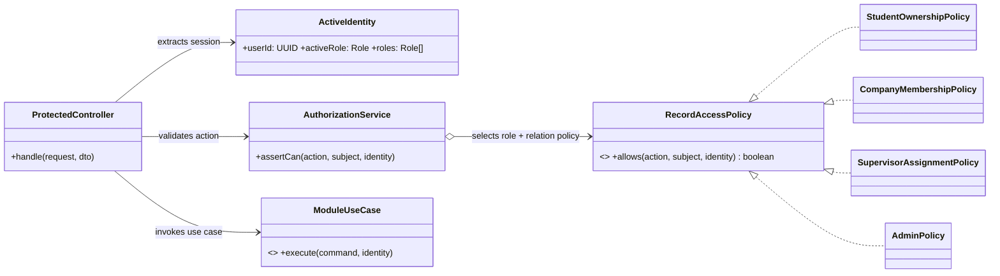
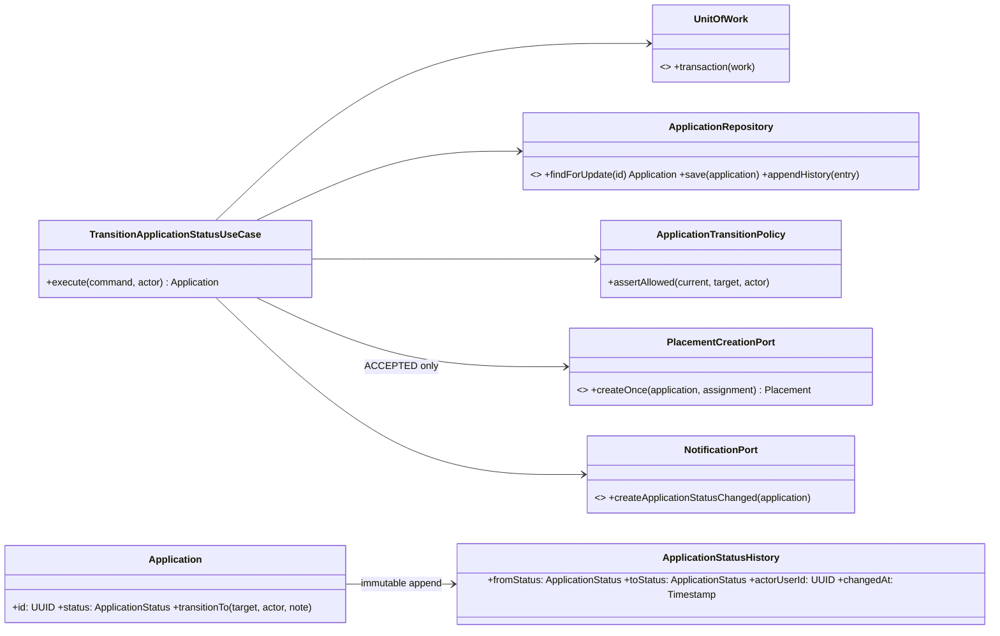
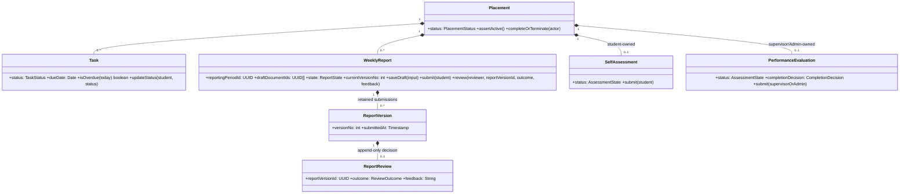
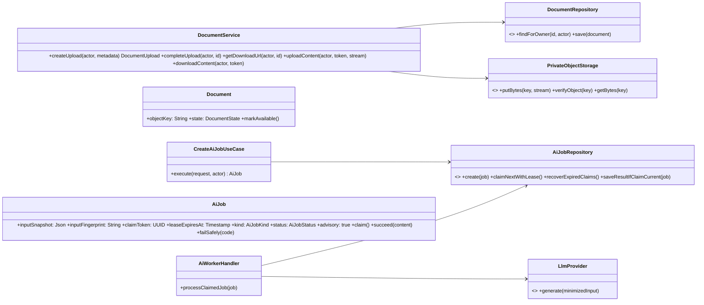
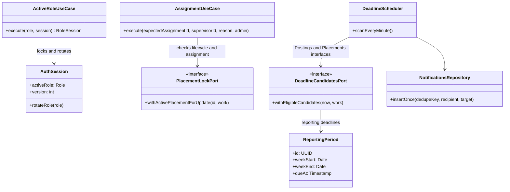

# Implementation Class Design

## Scope

This design refines [C4](../architecture/c4.md), [arc42](../architecture/arc42.md), [OpenAPI](../api/openapi.yaml), [database design](../database/database-design.md), and [code structure](../architecture/code-structure.md). Core API/domain abstractions are implemented; AI-worker abstractions remain deferred. Legacy AI interview screens are not product behavior.

## Requirement-to-code traceability

| Requirement | OpenAPI operation(s) | C3 component | Target source ownership | Detailed design |
| --- | --- | --- | --- | --- |
| RQ-01 | all protected operations; `getMe`, `setActiveRole`, `listEligibleSupervisors`, `listSupervisorAssignments`, `changeSupervisorAssignment` | Identity and Access; Organizations | `apps/api/src/modules/identity/`, `organizations/` | Authorization boundary and assignment/session protocols |
| RQ-02 | `getMyStudentProfile`, `updateMyStudentProfile`, `getMySkills`, `replaceMySkills`, `replaceMyPreferences` | Organizations and Student Profiles | `apps/api/src/modules/organizations/`; `apps/web/src/features/student-profile/` | Acceptance scenarios in traceability.md |
| RQ-03 | `createPosting`, `updatePosting`, `publishPosting`, `transitionPostingLifecycle` | Organizations; Postings | `apps/api/src/modules/postings/`; `apps/web/src/features/postings/` | Posting state |
| RQ-04 | `listPostings`, `getPosting` | Postings | `apps/api/src/modules/postings/`; `apps/web/src/features/postings/` | Acceptance scenarios in traceability.md |
| RQ-05 | `listPostings`, `getPosting`, `createAiJob` | Postings; AI Jobs | `packages/domain/src/matching/`; `apps/api/src/modules/postings/`, `ai-jobs/` | AI-job ownership |
| RQ-06 | `listSavedPostings`, `savePosting`, `unsavePosting` | Postings | `apps/api/src/modules/postings/`; `apps/web/src/features/postings/` | Acceptance scenarios in traceability.md |
| RQ-07 | `createApplication`, `listApplications`, `getApplication` | Applications; Documents | `apps/api/src/modules/applications/`, `documents/`; `apps/web/src/features/applications/` | Application aggregate and sequence |
| RQ-08 | `transitionApplicationStatus`, `withdrawApplication` | Applications; Placements; Notifications | `apps/api/src/modules/applications/`, `placements/`, `notifications/` | Aggregate, sequence, state |
| RQ-09 | `listPlacements`, `getPlacement`, `transitionPlacementLifecycle` | Placements and Progress | `apps/api/src/modules/placements/`; `apps/web/src/features/placements/` | Aggregate and state |
| RQ-10 | `listPlacementTasks`, `createTask`, `updateTaskStatus` | Placements; Notifications | `apps/api/src/modules/placements/`, `notifications/`; `apps/web/src/features/placements/` | Aggregate and state |
| RQ-11 | `listReportingPeriods`, `createReportDraft`, `saveReportDraft`, `submitReport`, `reviewReport` | Placements; Documents; Notifications | `apps/api/src/modules/placements/`, `documents/`, `notifications/` | Calendar, private drafts, version-conditional review, sequence and state |
| RQ-12 | `getSelfAssessment`, `upsertSelfAssessment` | Evaluations | `apps/api/src/modules/evaluations/`; `apps/web/src/features/evaluations/` | Aggregate and compact state |
| RQ-13 | `getPerformanceEvaluation`, `upsertPerformanceEvaluation` | Evaluations | `apps/api/src/modules/evaluations/`; `apps/web/src/features/evaluations/` | Aggregate and compact state |
| RQ-14 | `getMonitoring` | Monitoring | `apps/api/src/modules/monitoring/`; `apps/web/src/features/monitoring/` | Read-only acceptance scenarios in traceability.md |
| RQ-15 | `listNotifications`, `markNotificationRead`, `markAllNotificationsRead`; internal deadline scan | In-app Notifications | `apps/api/src/modules/notifications/`; `apps/web/src/features/notifications/` | Transactional collaborator and deduplicated scheduler |
| RQ-16 | `createAiJob`, `getAiJob` | AI Job Orchestration; worker | `apps/api/src/modules/ai-jobs/`; `apps/worker/src/` | AI-job ownership and sequence |

## Authorization and ownership boundary

The REST boundary authenticates and authorizes. The owning use case also performs relationship-aware checks before mutation; a role alone never grants record access. Repositories remain private to their API module.

## Application transition and idempotent placement

One transaction updates status, appends history, creates the accepted placement once, and inserts the recipient notification. Under an application row lock, compare an ACCEPTED replay with the immutable canonical acceptance command: identical returns existing result with no writes, different input returns 409. Only a first INTERVIEW-to-ACCEPTED transition writes history, placement, assignment, reporting periods and notification. Unique constraints backstop this protocol; createOnce alone is insufficient.

## Placement, progress, and independent evaluations

The placements module owns placement/progress persistence. Evaluations uses a placement-facing application interface for lifecycle and relationship checks, never a placement repository/table. The assessment aggregates remain separate and no grade is derived.

## Documents and advisory AI jobs

Documents owns object-storage authorization and never exposes object keys. The API creates AI jobs only after source authorization; the worker may claim and complete them but cannot mutate any authoritative workflow, score, task, evaluation, report, or notification.

## Calendar, assignment, and role protocol collaborators

Draft attachment links belong to WeeklyReport; immutable attachment links belong to ReportVersion. Projection code omits all private draft fields for nonowners. Review compares reportVersionId under the placement/report lock and has one row per version. Documents issues same-origin API URLs and streams bytes through PrivateObjectStorage. AI jobs own their immutable snapshot and claim fencing. Full rules and verification are in [behavior rules](./behavior-rules.md) and [traceability](./traceability.md).
