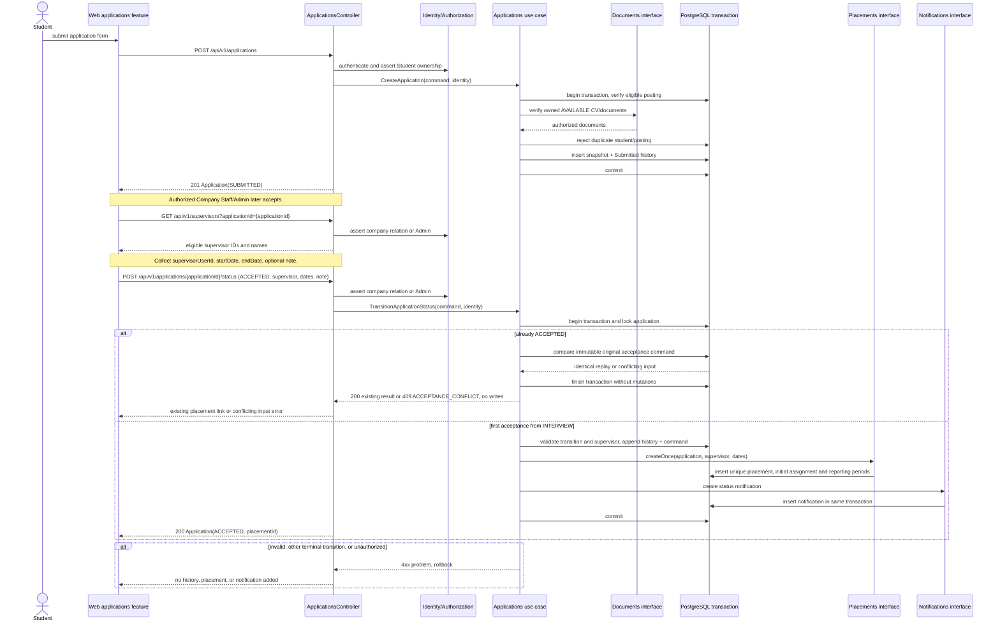
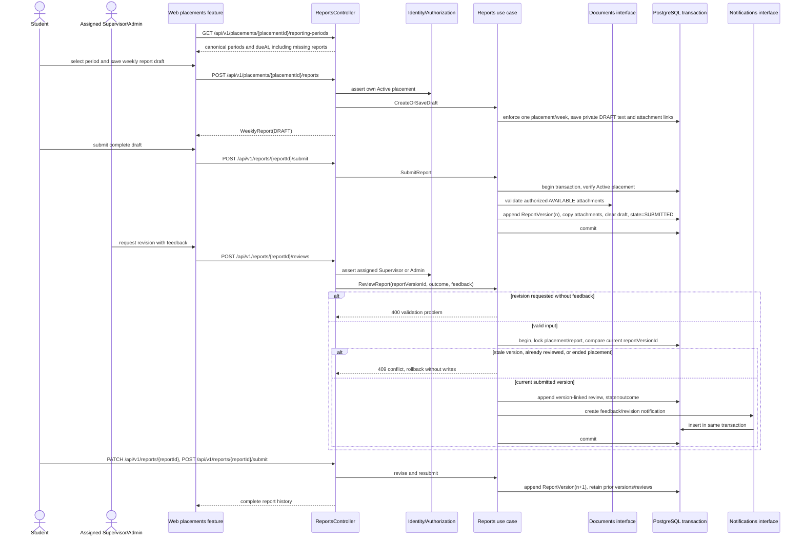
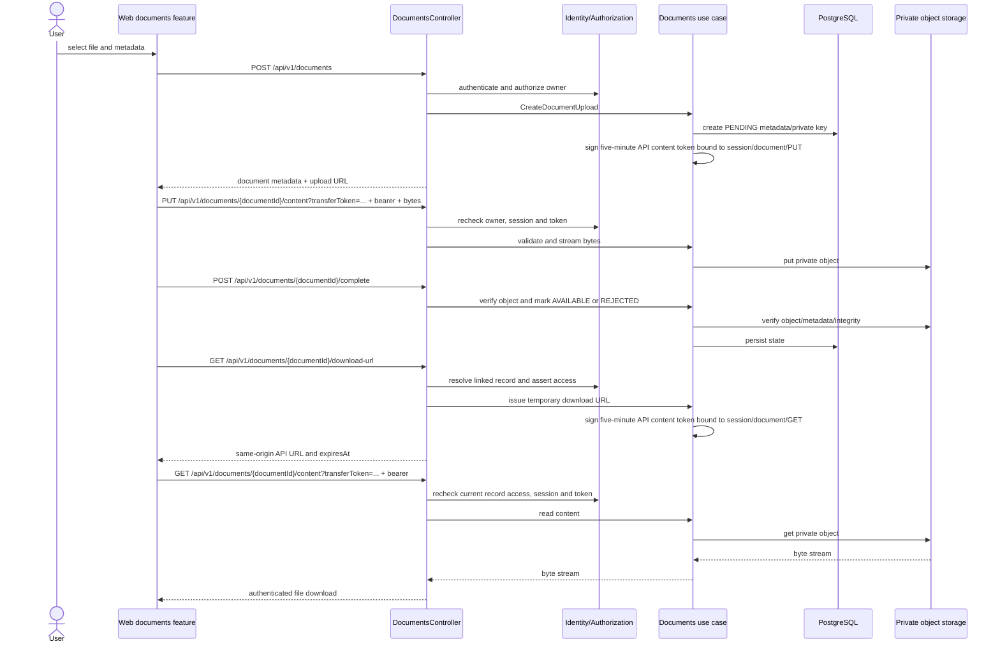
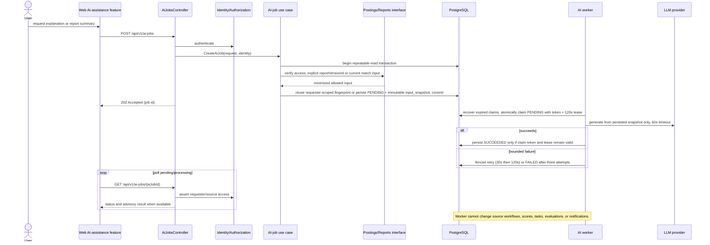
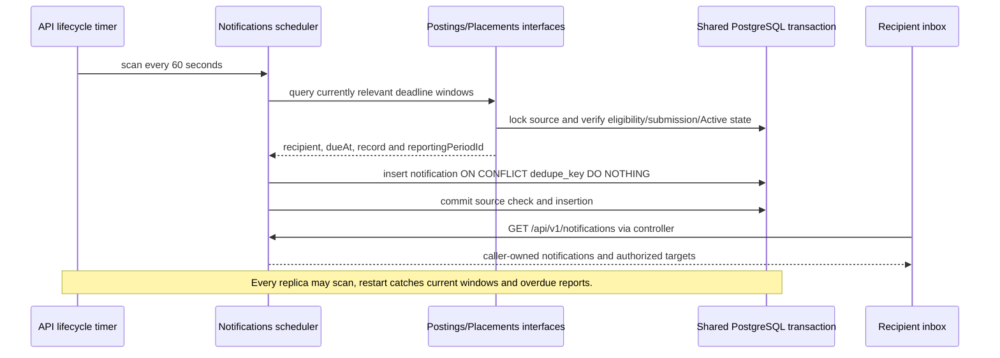

# Implementation Sequence Design

## Scope

These sequences follow [C4](../architecture/c4.md), [arc42](../architecture/arc42.md), [OpenAPI](../api/openapi.yaml), and [code structure](../architecture/code-structure.md). They show behavior where authorization, ordering, history, or transaction scope affects correctness. The API-backed client consumes these flows; diagrams remain design detail rather than runtime evidence.

## Application submission and acceptance

**Trace:** RQ-07/RQ-08 → `createApplication`, `transitionApplicationStatus` → Applications, Documents, Placements, Notifications → `apps/api/src/modules/applications/`, `documents/`, `placements/`, `notifications/`, `apps/web/src/features/applications/`.

## Weekly report: submit, review, revise

**Trace:** RQ-11/RQ-15 → `createReportDraft`, `saveReportDraft`, `submitReport`, `reviewReport` → Placements, Documents, Notifications → `apps/api/src/modules/placements/`, `documents/`, `notifications/`, `apps/web/src/features/placements/`.

## Authorized private document transfer

**Trace:** RQ-02/RQ-07/RQ-11 → `createDocumentUpload`, `completeDocumentUpload`, `getDocumentDownloadUrl`, `deleteDocument` → Documents → `apps/api/src/modules/documents/`, `apps/web/src/features/documents/`.

## Non-blocking AI assistance

**Trace:** RQ-05/RQ-11/RQ-16 → `createAiJob`, `getAiJob` → AI Job Orchestration, AI worker → `apps/api/src/modules/ai-jobs/`, `apps/worker/src/`, `apps/web/src/features/ai-assistance/`.

## Deadline scheduling without AI

Role switching and assignment commands follow the lock/authorization protocols in [behavior rules](./behavior-rules.md). [Traceability](./traceability.md) includes their success, revocation, and conflict scenarios. API prefix is always `/api/v1`, OpenAPI is the canonical method/path/error contract.
