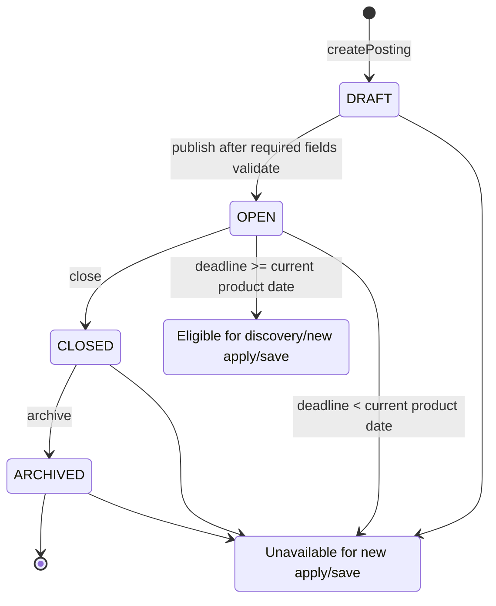
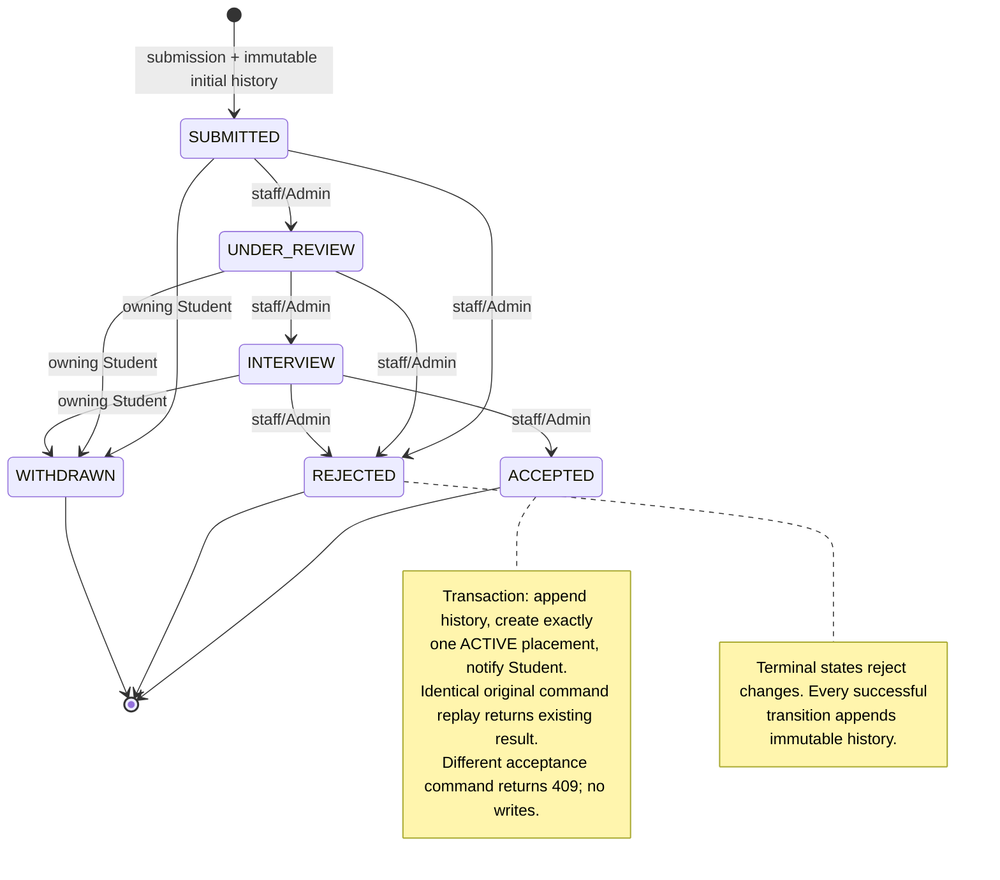
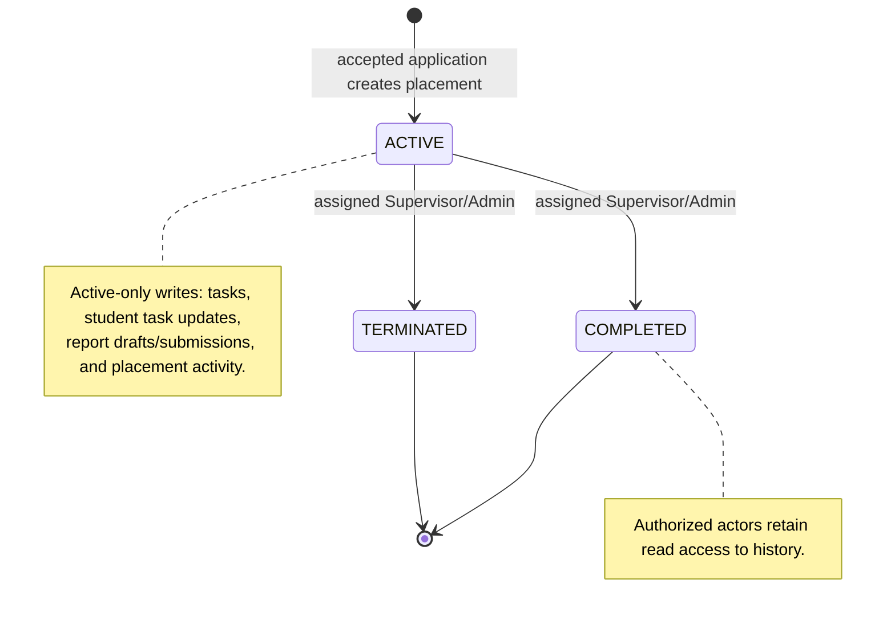
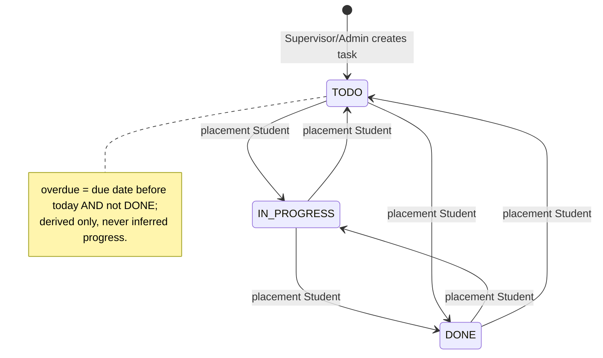
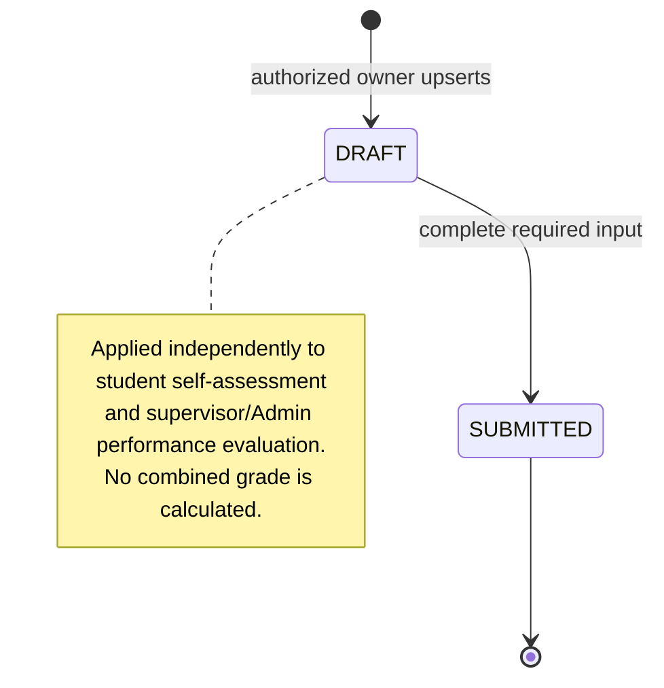
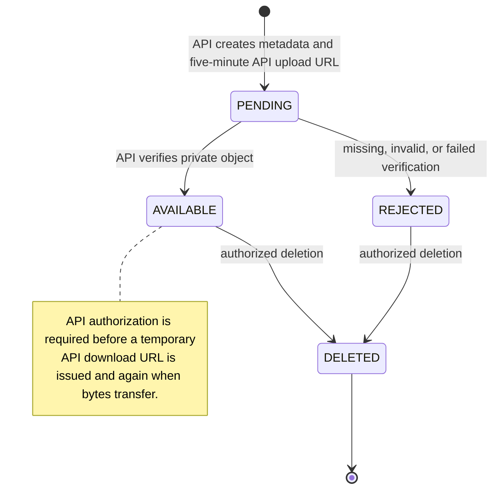

# Lifecycle State Design

## Scope

These lifecycle rules come from the [requirements](../requirements/requirements.md), [OpenAPI](../api/openapi.yaml), and [database design](../database/database-design.md). API writes are authorized by the owning module below `apps/api/src/modules/`; the API-backed frontend reflects, but does not define, these transitions.

## Posting lifecycle and derived eligibility

**Trace:** RQ-03–RQ-06 → `publishPosting`, `transitionPostingLifecycle`, `createApplication`, `savePosting` → Postings → `apps/api/src/modules/postings/`.

Eligibility is derived from `OPEN` plus deadline, never stored independently. Closing/archiving preserves prior applications, saves, and placements.

## Application status and accepted-placement effect

**Trace:** RQ-07/RQ-08/RQ-15 → `createApplication`, `transitionApplicationStatus`, `withdrawApplication` → Applications, Placements, Notifications → `apps/api/src/modules/applications/`, `placements/`, `notifications/`.

## Placement, tasks, and assessments

**Trace:** RQ-09/RQ-10/RQ-12/RQ-13 → `transitionPlacementLifecycle`, `updateTaskStatus`, assessment upserts → Placements; Evaluations → `apps/api/src/modules/placements/`, `evaluations/`.

Performance evaluation records one human-entered decision: `PASSED`, `FAILED`, `PENDING`, or `INCOMPLETE`.

## Weekly-report lifecycle and versions

**Trace:** RQ-11/RQ-15 → `createReportDraft`, `saveReportDraft`, `submitReport`, `reviewReport` → Placements, Documents, Notifications → `apps/api/src/modules/placements/`, `documents/`, `notifications/`.

```mermaid
stateDiagram-v2
  [*] --> DRAFT: create for placement + reporting week
  DRAFT --> DRAFT: save draft
  DRAFT --> SUBMITTED: submit complete report; append version n
  SUBMITTED --> APPROVED: expected version matches; append review
  SUBMITTED --> REVISION_REQUESTED: expected version matches and nonblank feedback; review + notify
  REVISION_REQUESTED --> REVISION_REQUESTED: save private revision and attachment links
  REVISION_REQUESTED --> SUBMITTED: resubmit; append version n+1 and clear draft
  APPROVED --> [*]
  note right of DRAFT
    One aggregate per canonical reporting period.
    Draft text/attachments always belong only to Student.
  end note
  note right of SUBMITTED
    Versions and reviews are append-only. Reviews carry reportVersionId; stale reviews return 409.
    An ended placement rejects drafts, submissions and reviews.
  end note
```

## Document upload lifecycle

**Trace:** RQ-02/RQ-07/RQ-11 → `createDocumentUpload`, `completeDocumentUpload`, `deleteDocument` → Documents → `apps/api/src/modules/documents/`.

## Advisory AI-job lifecycle

**Trace:** RQ-16 → `createAiJob`, `getAiJob` → AI Job Orchestration, AI worker → `apps/api/src/modules/ai-jobs/`, `apps/worker/src/`.

```mermaid
stateDiagram-v2
  [*] --> PENDING: API authorizes and snapshots immutable input
  PENDING --> PROCESSING: worker claims with token and 120-second lease
  PROCESSING --> SUCCEEDED: current unexpired claim token writes advisory result
  PROCESSING --> PENDING: transient failure or expired lease; retry below three attempts
  PROCESSING --> FAILED: non-retryable or retry limit
  SUCCEEDED --> [*]
  FAILED --> [*]
  note right of PENDING
    Only MATCH_EXPLANATION or REPORT_SUMMARY.
    Failure/delay never blocks core workflows.
  end note
  note right of SUCCEEDED
    Generated content is advisory and separate from
    source records and human decisions.
  end note
```

## Session, assignment and calendar invariants

Role switching rotates the current session version only after validating membership. Assignment replacement atomically revokes the old row and creates the new row; revocation without replacement leaves the Active placement temporarily unassigned under Admin responsibility. Neither changes the immutable acceptance command. Reporting periods are generated at acceptance and do not depend on report state; deadline reminders cannot change report lifecycle. See [behavior rules](./behavior-rules.md) and [traceability](./traceability.md).
